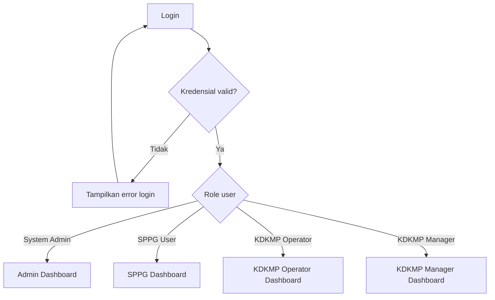
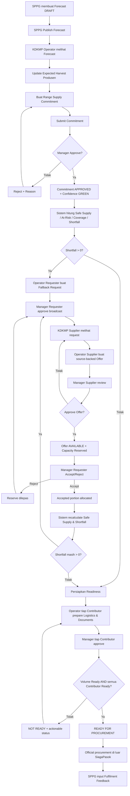
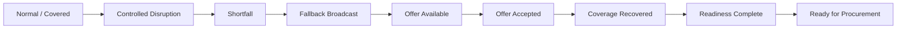

# SIAGAPASOK

## User Flow Specification

**Pre-Procurement Supply Orchestration System untuk Rantai Pasok MBG**

> **STATUS DOKUMEN**  
> DRAFT FOR REVIEW — Foundation Document 2 of 5.  
> Dokumen ini menerjemahkan PRD SiagaPasok V1 menjadi alur pengguna, alur layar, approval path, exception path, dan cross-organization flow. Dokumen ini belum menentukan schema database, visual styling final, atau struktur kode.

| Item | Keputusan |
|---|---|
| Versi | 1.0 |
| Tanggal | 9 Agustus 2026 |
| Dokumen sebelumnya | `01_SiagaPasok_PRD_V1.md` |
| Dokumen berikutnya | `03_SiagaPasok_ERD_V1.md` |
| Target | Working MVP lokal untuk demonstrasi BEC4 2026 |
| Bahasa UI | Bahasa Indonesia utama |
| Account model | Closed account; tidak ada public registration |
| Organization model | One user = one organization untuk MVP |
| Aktor bisnis | SPPG User, KDKMP Operator/FRPL, KDKMP Manager |
| Aktor administratif | System Admin |

---

# 1. Tujuan Dokumen

User Flow ini mengunci **bagaimana setiap aktor bergerak di dalam SiagaPasok**, dari login sampai suatu kebutuhan dinyatakan `READY FOR PROCUREMENT` dan kemudian menerima `Fulfilment Feedback` setelah proses resmi selesai.

Dokumen ini bertujuan untuk memastikan bahwa:

1. setiap role memiliki jalur kerja yang jelas;
2. maker-checker tidak dapat dilewati;
3. detail produsen tidak bocor antarorganisasi;
4. perubahan risiko langsung memengaruhi Safe Supply;
5. fallback hanya dihitung setelah melalui approval dan acceptance yang benar;
6. Ready for Procurement tidak pernah menjadi tombol manual;
7. exception dan edge case utama memiliki perilaku yang konsisten sebelum ERD dirancang.

## 1.1 Hierarki Keputusan

Jika terdapat konflik pada tahap berikutnya, gunakan urutan berikut:

1. keputusan eksplisit pengguna;
2. `01_SiagaPasok_PRD_V1.md`;
3. Final Concept Blueprint;
4. Final Essay Architecture;
5. audit riset dan audit logika terbaru.

## 1.2 Boundary User Flow

User Flow SiagaPasok **dimulai** ketika SPPG menyiapkan Forecast kebutuhan dan **berakhir secara operasional** ketika sistem menunjukkan `READY FOR PROCUREMENT`.

Setelah titik tersebut, vendor selection, Purchase Order, pembayaran, receiving, physical QC, dan proses procurement resmi berlangsung di luar SiagaPasok.

SiagaPasok hanya membuka kembali alur pra-pengadaan jika kondisi sebelum fulfilment berubah dan menyebabkan supply/readiness memburuk.

---

# 2. Prinsip Navigasi dan Interaction Model

## 2.1 Role-Based Entry

Setelah login berhasil, user tidak memilih organisasi secara manual. Sistem langsung memuat konteks organisasi dan role yang telah ditetapkan administrator.



## 2.2 No Public Registration

Tidak ada alur:

`Landing Page → Register → Create Organization`

Organization dan account hanya dibuat melalui System Admin.

## 2.3 Organization Isolation

Pada semua layar operasional:

- Operator dan Manager hanya dapat mengakses data internal KDKMP mereka sendiri.
- KDKMP lain hanya melihat fallback broadcast yang memang dibuka untuk jaringan.
- SPPG hanya melihat informasi agregat dan contributor organization.
- System Admin tidak memiliki menu untuk mengubah supply, commitment, fallback, atau readiness.

## 2.4 Approval UX Principle

Semua flow maker-checker menggunakan pola:

`Operator Prepare → Submit → Record Locked → Manager Review Read-Only → Approve / Reject`

Jika ditolak:

`Reject + Reason → Operator receives notification → Revise as new draft/revision → Submit again`

Manager tidak mengedit payload milik Operator saat review.

---

# 3. Global Information Architecture per Role

Dokumen ini hanya menentukan **alur dan kelompok layar**, bukan layout visual final.

## 3.1 System Admin

- Dashboard Administrasi
- Organisasi
- Pengguna
- Role & Status Akun
- Metadata Audit Platform
- Logout

## 3.2 SPPG User

- Dashboard SPPG
- Forecast Kebutuhan
- Detail Forecast
- Monitoring Supply & Coverage
- Readiness Agregat
- Fulfilment Feedback
- Notifikasi
- Logout

## 3.3 KDKMP Operator / FRPL

- Dashboard KDKMP
- Forecast Aktif
- Produsen
- Expected Harvest
- Supply Commitment
- Monitoring Confidence
- Fallback Request
- Jaringan Fallback
- Fallback Offer
- Logistics Readiness
- Document Readiness
- Notifikasi
- Logout

## 3.4 KDKMP Manager

- Dashboard KDKMP
- Approval Queue
- Commitment Review
- Recovery Review
- Fallback Request Review
- Outgoing Offer Review
- Incoming Offer Decision
- Logistics Readiness Review
- Document Readiness Review
- Monitoring Supply
- Notifikasi
- Logout

---

# 4. Master End-to-End User Flow



---

# 5. Flow System Admin

## UF-ADM-01 — Membuat Organization

**Trigger:** organisasi SPPG/KDKMP baru perlu ditambahkan ke MVP.

**Actor:** System Admin.

**Precondition:** Admin sudah login.

**Flow:**

1. Admin membuka `Organisasi`.
2. Admin memilih `Tambah Organisasi`.
3. Admin memilih tipe `SPPG` atau `KDKMP`.
4. Admin mengisi identitas minimum organisasi.
5. Admin menyimpan.
6. Sistem membuat organization aktif.
7. Sistem mencatat audit event administratif.
8. Admin diarahkan ke detail organization atau daftar organization.

**Failure/exception:**

- identifier organisasi duplikat → sistem menolak;
- field wajib kosong → sistem menampilkan validation error;
- organization yang sudah memiliki data operasional tidak di-hard-delete; gunakan deactivation.

## UF-ADM-02 — Membuat / Mengaktifkan User

1. Admin membuka detail organization.
2. Pilih `Tambah Pengguna`.
3. Masukkan identitas user dan role yang valid untuk organization tersebut.
4. Sistem membuat account yang terikat hanya ke organization itu.
5. Admin dapat mengaktifkan/nonaktifkan account.
6. Perubahan role/status dicatat di audit metadata.

---

# 6. Flow SPPG — Demand Forecast

## UF-SPPG-01 — Membuat Forecast DRAFT

**Actor:** SPPG User.

**Entry:** `Dashboard SPPG → Forecast Kebutuhan → Buat Forecast`.

**Input minimum:**

- komoditas;
- target volume;
- unit;
- required date / required period;
- response/freshness configuration bila digunakan;
- catatan opsional.

**Flow:**

1. SPPG mengisi kebutuhan operasional.
2. Sistem memvalidasi volume > 0 dan tanggal/periode valid.
3. SPPG menyimpan sebagai `DRAFT`.
4. DRAFT belum terlihat oleh KDKMP.
5. SPPG dapat kembali mengedit draft.

**Important:** aplikasi tidak menghitung Demand Target dari AKG/BDD. Demand Target merupakan input operasional SPPG.

## UF-SPPG-02 — Publish Forecast

1. SPPG membuka Forecast `DRAFT`.
2. Review ringkasan demand.
3. Klik `Publikasikan Forecast`.
4. Sistem meminta konfirmasi.
5. Setelah konfirmasi, status menjadi `PUBLISHED`.
6. Forecast muncul pada KDKMP yang berada dalam scope jaringan MVP.
7. Sistem membuat audit event.

**System reaction:** Safe Supply awal dapat bernilai 0; Shortfall dihitung secara derived tetapi belum berarti kegagalan karena commitment mungkin belum tersedia.

## UF-SPPG-03 — Monitoring Forecast

Pada detail Forecast PUBLISHED, SPPG melihat hanya agregat:

- Demand Target;
- Safe Supply;
- At-Risk Supply;
- Shortfall;
- Coverage %;
- daftar contributor organization;
- status Volume Ready;
- status readiness per contributor secara agregat;
- final Ready for Procurement.

SPPG **tidak** mendapatkan akses drill-down ke nama petani atau expected harvest individual.

## UF-SPPG-04 — Revisi Demand

**Trigger:** kebutuhan berubah sebelum forecast CLOSED.

1. SPPG membuka Forecast PUBLISHED.
2. Pilih `Revisi Forecast`.
3. Ubah target volume dan/atau periode yang masih diperbolehkan.
4. Sistem meminta alasan revisi volume/tanggal.
5. Simpan.
6. Sistem mencatat before/after.
7. Sistem recalculates Coverage, Shortfall, Volume Ready, dan RFP.
8. Contributor terkait menerima notifikasi jika perubahan material.

### Jika demand naik

- Safe Supply tidak berubah.
- Coverage turun.
- Shortfall dapat muncul.
- RFP otomatis FALSE jika volume tidak cukup.
- KDKMP dapat membuka fallback request baru jika dibutuhkan.

### Jika demand turun

- Coverage naik.
- Surplus dapat muncul.
- Accepted fallback tidak dilepas otomatis.
- Bila supply yang sudah dialokasikan melebihi kebutuhan, UI menunjukkan `Surplus`.

## UF-SPPG-05 — Cancel Forecast

1. SPPG memilih `Batalkan Forecast`.
2. Sistem memeriksa apakah ada Accepted Fallback Allocation.
3. Jika **tidak ada**, SPPG wajib mengisi alasan → forecast `CANCELLED`.
4. Jika **ada**, sistem memblokir cancellation dan menampilkan conflict message.
5. Conflict komersial/alokasi harus diselesaikan secara manual di luar MVP sebelum cancel diperbolehkan.

## UF-SPPG-06 — Close Forecast

Forecast menjadi `CLOSED` ketika required period telah selesai atau proses pra-pengadaan dinyatakan selesai sesuai boundary waktu sistem.

State CLOSED bersifat terminal.

---

# 7. Flow KDKMP Operator — Producer & Expected Harvest

## UF-OP-01 — Kelola Producer Registry

1. Operator membuka `Produsen`.
2. Melihat hanya produsen milik KDKMP sendiri.
3. Operator dapat tambah/edit producer aktif.
4. Producer dapat dikaitkan dengan komoditas dan informasi lokasi internal.
5. Perubahan material dicatat sesuai kebutuhan audit.

**Privacy:** Tidak ada data producer yang muncul pada dashboard KDKMP lain atau SPPG.

## UF-OP-02 — Input Expected Harvest

1. Operator membuka Forecast atau menu `Expected Harvest`.
2. Pilih producer.
3. Pilih commodity.
4. Input estimated min/max atau estimasi volume yang sesuai bentuk final ERD nanti.
5. Input harvest window.
6. Simpan.
7. Expected Harvest langsung aktif sebagai informasi internal.

**No Manager approval.**

**Critical rule:** Expected Harvest tidak pernah masuk Safe Supply.

## UF-OP-03 — Update Expected Harvest

1. Operator menerima informasi baru dari produsen melalui komunikasi offline/WhatsApp/kunjungan.
2. Operator update estimasi.
3. Sistem menyimpan perubahan.
4. Jika perubahan material memengaruhi rasionalitas commitment yang sudah ada, sistem dapat menampilkan warning tetapi tidak otomatis mengubah commitment tanpa workflow confidence/revision.

---

# 8. Flow Supply Commitment

## UF-COM-01 — Membuat Commitment

**Actor:** KDKMP Operator.

1. Operator membuka detail Forecast.
2. Pilih `Buat Commitment`.
3. Pilih producer/sumber internal yang relevan.
4. Input minimum volume dan maximum volume.
5. Input availability/required window dan catatan.
6. Sistem memvalidasi `min <= max`, volume > 0, commodity cocok, dan period valid.
7. Jika commitment melebihi Expected Harvest yang diketahui, tampilkan soft warning dan minta justification.
8. Simpan sebagai `DRAFT`.

## UF-COM-02 — Submit Commitment

1. Operator membuka DRAFT.
2. Review data.
3. Klik `Ajukan Persetujuan`.
4. Status menjadi `PENDING_APPROVAL`.
5. Payload dikunci dari edit Operator.
6. Manager menerima notifikasi approval.

## UF-COM-03 — Manager Approve

1. Manager membuka `Approval Queue`.
2. Membuka commitment.
3. Sistem menampilkan detail read-only + maker identity.
4. Backend memastikan `Maker ID != Checker ID`.
5. Manager klik `Setujui`.
6. Status menjadi `APPROVED`.
7. Confidence awal menjadi `GREEN`.
8. Minimum volume mulai masuk Safe Supply.
9. Dashboard dan Forecast direcalculate.
10. Operator menerima notifikasi keputusan.

## UF-COM-04 — Manager Reject

1. Manager membuka commitment PENDING_APPROVAL.
2. Klik `Tolak`.
3. Reason wajib diisi.
4. Status menjadi `REJECTED`.
5. Commitment tidak berkontribusi pada Safe Supply.
6. Operator menerima notifikasi.
7. Untuk memperbaiki, Operator membuat/revisi ke DRAFT sesuai versioning yang akan ditetapkan ERD.

---

# 9. Flow Confidence, Risk, dan Recovery

## UF-RISK-01 — Downgrade GREEN → YELLOW

**Trigger:** kondisi supply menjadi berisiko, termasuk stale data.

1. Operator membuka commitment APPROVED.
2. Pilih `Laporkan Risiko`.
3. Pilih status `YELLOW`.
4. Reason wajib.
5. Simpan.
6. Perubahan langsung efektif tanpa Manager approval.
7. Minimum volume commitment langsung keluar dari Safe Supply.
8. Volume berpindah ke At-Risk Supply.
9. Coverage/Shortfall/RFP direcalculate.
10. Manager dan pihak terkait menerima notification.

## UF-RISK-02 — Downgrade ke RED

1. Operator membuka commitment GREEN/YELLOW.
2. Pilih RED dan isi reason.
3. Status langsung RED.
4. Contribution menjadi 0.
5. RED terminal.
6. Jika supply baru muncul kemudian, buat commitment baru; jangan revive RED.

## UF-RISK-03 — System Stale Downgrade

1. Sistem mengevaluasi `last_verified_at` terhadap freshness configuration forecast.
2. GREEN yang melewati threshold menjadi YELLOW otomatis.
3. Sistem membuat audit event dengan actor `SYSTEM`.
4. Safe Supply direcalculate.
5. Operator menerima notification untuk melakukan verifikasi.

## UF-RISK-04 — Recovery YELLOW → GREEN

1. Operator membuka commitment YELLOW.
2. Pilih `Ajukan Pemulihan`.
3. Input alasan/evidence note operasional.
4. Status recovery menjadi `PENDING_RECOVERY` tanpa menaikkan Safe Supply.
5. Manager menerima approval request.
6. Manager review read-only.
7. Jika reject → commitment tetap YELLOW.
8. Jika approve → confidence menjadi GREEN.
9. Minimum volume kembali masuk Safe Supply.
10. Sistem recalculates Shortfall dan RFP.

## UF-RISK-05 — Revisi Range Commitment Setelah Risiko

**Rule utama:** revisi angka dan pelaporan risiko adalah dua hal berbeda.

1. Operator mengetahui volume lama tidak lagi realistis.
2. Sebelum revisi, commitment harus sudah YELLOW/RED sehingga volume lama tidak dianggap Safe.
3. Operator memilih `Revisi Commitment`.
4. Masukkan range baru dan justification.
5. Submit sebagai `PENDING_REVISION`.
6. Selama pending, contribution Safe Supply = 0.
7. Manager review.
8. Jika revision ditolak → commitment lama tetap tidak otomatis GREEN; status confidence mengikuti kondisi risiko terakhir.
9. Jika revision disetujui → revised range menjadi approved payload.
10. Jika kondisi layak dipulihkan, GREEN hanya aktif melalui approval recovery yang sah.

---

# 10. Flow Shortfall Detection

## UF-SHORT-01 — Automatic Detection

Shortfall bukan record yang dibuat manual.

Setiap perubahan berikut memicu recalculation:

- Demand Target berubah;
- commitment APPROVED masuk/keluar;
- confidence berubah;
- accepted fallback berubah/degrade;
- commitment expired/cancelled.

Formula:

`Shortfall = max(0, Demand Target - Safe Supply)`

Jika Shortfall > 0:

- dashboard menampilkan nilai kekurangan;
- Coverage turun;
- Operator + Manager requester menerima actionable notification;
- Fallback Request dapat dibuat.

Tidak ada label LOW/MEDIUM/CRITICAL pada MVP. UI cukup menunjukkan:

- volume shortfall;
- Coverage %;
- required date / time remaining.

---

# 11. Flow Fallback Request — KDKMP Requester

## UF-FR-01 — Create Fallback Request

**Actor:** KDKMP Operator requester.

**Precondition:** Forecast PUBLISHED dan Shortfall > 0.

1. Operator membuka Forecast dengan shortfall.
2. Pilih `Siapkan Fallback Request`.
3. Sistem prefill:
   - commodity;
   - current shortfall;
   - required date/period.
4. Operator menetapkan requested volume yang tidak boleh melebihi kebutuhan yang logis, response deadline, dan note agregat.
5. Data yang akan dibroadcast ditampilkan sebagai preview.
6. Simpan DRAFT.
7. Submit → `PENDING_APPROVAL`.
8. Manager requester menerima notification.

## UF-FR-02 — Manager Approve Broadcast

1. Manager membuka request PENDING_APPROVAL.
2. Melihat aggregate broadcast payload, bukan data producer yang akan dibagikan.
3. Approve → status `OPEN`.
4. Request terlihat oleh KDKMP lain dalam network scope.
5. Audit event dibuat.

Jika reject:

- reason wajib;
- request tidak dibroadcast;
- Operator menerima notification.

## UF-FR-03 — Partial Recovery

Fallback Request **tidak membutuhkan state PARTIALLY_FULFILLED** pada MVP.

Jika request 150 kg dan baru 80 kg accepted:

- state tetap `OPEN`;
- `remaining_shortfall` ditampilkan sebagai derived value;
- supplier lain masih dapat membuat Offer terhadap remaining requirement.

Jika accepted fallback memenuhi target request:

- request menjadi `FULFILLED`;
- tidak menerima offer baru.

## UF-FR-04 — Expiry / Cancellation

- Response deadline lewat → `EXPIRED` dan tidak menerima offer baru.
- Manager requester dapat cancel request aktif dengan reason bila shortfall telah dipulihkan melalui supply internal atau request tidak lagi dibutuhkan.
- Offer yang belum accepted mengikuti aturan release reserve masing-masing.

---

# 12. Flow Fallback Offer — KDKMP Supplier

## UF-FO-01 — Supplier Melihat Broadcast

KDKMP supplier hanya melihat:

- requester organization;
- commodity;
- requested/remaining volume;
- required date/period;
- response deadline;
- note agregat yang aman.

KDKMP supplier tidak melihat producer requester, individual commitment, internal capacity, atau detail sensitif lainnya.

## UF-FO-02 — Create Source-Backed Offer

1. Operator supplier membuka Fallback Request OPEN.
2. Pilih `Buat Penawaran Pasokan`.
3. Sistem menampilkan **eligible available fallback capacity** internal.
4. Operator input offered volume dan availability note.
5. Offered volume tidak boleh melebihi eligible capacity saat submit/review.
6. Simpan DRAFT.
7. Submit → `PENDING_APPROVAL`.
8. Manager supplier menerima notification.

## UF-FO-03 — Manager Supplier Approve Offer

1. Manager membuka offer PENDING_APPROVAL.
2. Review offered volume dan internal capacity context.
3. Klik `Setujui Penawaran`.
4. Backend melakukan atomic capacity check/reservation.
5. Jika reserve berhasil:
   - status → `AVAILABLE`;
   - offered capacity menjadi reserved;
   - Manager requester menerima notification.
6. Jika reserve gagal karena kapasitas sudah berubah:
   - approval ditolak;
   - status tidak berubah menjadi AVAILABLE;
   - Manager melihat conflict message;
   - Operator perlu menyesuaikan offer.

## UF-FO-04 — Manager Requester Accept Sebagian/Seluruh Offer

1. Manager requester membuka Offer AVAILABLE.
2. Melihat supplier organization, offered volume, availability, expiry.
3. Pilih `Accept` dan accepted volume sesuai kebutuhan yang diperbolehkan.
4. Backend melakukan atomic validation:
   - offer masih AVAILABLE;
   - belum expired;
   - underlying supply masih valid;
   - request masih OPEN;
   - accepted volume tidak melebihi remaining requirement/allowed rule;
   - reserve masih tersedia.
5. Accepted portion menjadi allocated.
6. Unused reserve dilepas.
7. Offer → `ACCEPTED`.
8. Safe Supply requester direcalculate.
9. Request dapat tetap OPEN atau menjadi FULFILLED berdasarkan remaining shortfall.

## UF-FO-05 — Reject

1. Manager requester pilih `Reject`.
2. Offer → `REJECTED`.
3. Reserved capacity dilepas.
4. Supplier menerima notification.

## UF-FO-06 — Withdraw Sebelum Acceptance

Manager supplier dapat menarik Offer selama belum ACCEPTED. Penarikan merupakan keputusan bisnis supplier-side, bukan aksi Operator.

Result:

- status `WITHDRAWN`;
- reserve dilepas;
- requester diberi notification bila offer sebelumnya AVAILABLE.

Tidak ada unilateral withdrawal setelah ACCEPTED.

## UF-FO-07 — Expired Offer

Ketika expiry tercapai:

- AVAILABLE → EXPIRED;
- reserve dilepas;
- Accept endpoint wajib menolak stale UI/request;
- untuk menawarkan lagi harus membuat Offer baru.

---

# 13. Fallback Degradation Setelah Offer Accepted

`ACCEPTED` menunjukkan keputusan alokasi, **bukan jaminan biologis permanen**.

## UF-FO-08 — Underlying Supply Menjadi YELLOW/RED

1. KDKMP supplier memiliki accepted fallback contribution.
2. Operator supplier melaporkan risiko pada underlying supply.
3. Confidence turun langsung.
4. Accepted commercial allocation tetap tercatat secara historis.
5. Contribution yang tidak lagi GREEN keluar dari Safe Supply requester.
6. Requester Forecast direcalculate.
7. Shortfall dapat muncul kembali.
8. RFP dapat berubah TRUE → FALSE.
9. Requester menerima notification.
10. Recovery dilakukan melalui cycle fallback baru atau recovery underlying supply yang valid; terminal fallback request lama tidak dihidupkan ulang secara diam-diam.

---

# 14. Flow Logistics Readiness

## UF-LOG-01 — Operator Prepare

**Scope:** per Forecast / delivery context dan per contributing KDKMP.

1. KDKMP menjadi contributor Safe Supply > 0.
2. Operator membuka `Logistics Readiness` Forecast.
3. Checklist minimal dapat mencakup:
   - jadwal pickup/delivery terkonfirmasi;
   - kendaraan tersedia;
   - PIC logistik tersedia;
   - container/packaging tersedia bila relevan;
   - delivery time feasible.
4. Operator mengisi checklist + notes bila diperlukan.
5. Save DRAFT.
6. Submit → `PENDING_APPROVAL`.
7. Manager menerima notification.

## UF-LOG-02 — Manager Approve / Reject

- Approve → `APPROVED`.
- Reject → `REJECTED`, reason wajib.
- Manager tidak mengedit checklist saat review.

## UF-LOG-03 — Invalidation

Jika setelah approval Operator mengubah checklist atau kondisi logistik memburuk:

1. approval lama langsung tidak berlaku;
2. status kembali membutuhkan review (`PENDING_APPROVAL` / equivalent state pada ERD);
3. RFP direcalculate;
4. jika sebelumnya TRUE, dapat langsung FALSE;
5. notification dikirim.

Tidak ada physical QC pada flow ini.

---

# 15. Flow Document Readiness

## UF-DOC-01 — Evaluasi Dokumen

Document Readiness dapat menggabungkan requirement:

- organization-level yang valid;
- forecast-specific jika memang dikonfigurasi.

Detail jenis dokumen harus configurable dan tidak dianggap universal MBG di source code.

## UF-DOC-02 — Operator Prepare

1. Operator membuka `Document Readiness`.
2. Sistem menampilkan checklist requirement yang berlaku.
3. Operator menandai ketersediaan/validitas dan mengisi detail yang diminta.
4. Submit → `PENDING_APPROVAL`.
5. Manager menerima notification.

## UF-DOC-03 — Manager Approve / Reject

- Approve jika semua requirement yang berlaku terpenuhi.
- Reject membutuhkan reason.
- Approved checklist tidak dapat dimutasi diam-diam.

## UF-DOC-04 — Expiry / Revision Invalidation

Jika dokumen/requisite yang menjadi dependency tidak lagi valid sebelum required period:

- Document Ready menjadi FALSE/pending;
- RFP direcalculate;
- SPPG dan contributor terkait menerima notification.

---

# 16. Ready for Procurement Flow

## UF-RFP-01 — Derived Evaluation

Tidak ada user yang menekan tombol `Set Ready for Procurement`.

Sistem mengevaluasi:

```text
Volume Ready = Safe Supply >= Demand Target

READY FOR PROCUREMENT =
Volume Ready
AND setiap Contributor memiliki Logistics Ready APPROVED
AND setiap Contributor memiliki Document Ready VALID/APPROVED
```

Contributor adalah KDKMP dengan kontribusi Safe Supply > 0 pada Forecast tersebut.

## UF-RFP-02 — RFP Menjadi TRUE

1. Supply cukup.
2. Semua contributor Logistics Ready.
3. Semua contributor Document Ready.
4. Sistem mengubah derived result menjadi TRUE.
5. SPPG melihat `READY FOR PROCUREMENT`.
6. Contributor managers dan SPPG menerima notification.
7. Audit event calculated transition dicatat.

## UF-RFP-03 — RFP Kembali FALSE

RFP harus langsung hilang jika salah satu kondisi berikut terjadi:

- GREEN → YELLOW/RED mengurangi supply;
- commitment cancelled/expired;
- accepted fallback underlying supply degrade;
- demand meningkat;
- logistics approval invalid/revoked;
- document readiness invalid/expired;
- required boundary terlewati.

Flow:

`Dependency changes → Recalculate → RFP FALSE → Notification → User kembali ke recovery/readiness flow yang relevan.`

---

# 17. Fulfilment Feedback Flow

## UF-FUL-01 — Input Setelah Official Process

**Actor:** SPPG User.

**Precondition:** proses procurement/delivery resmi telah berlangsung di luar SiagaPasok.

1. SPPG membuka Forecast yang sudah melewati orchestration.
2. Pilih `Catat Fulfilment`.
3. Pilih contributor.
4. Sistem menampilkan planned/allocated volume sebagai reference.
5. SPPG input:
   - delivered volume;
   - fulfilment date;
   - result jika tidak derived otomatis;
   - reason/note jika partial/failed.
6. Save.
7. Audit event dibuat.
8. KDKMP terkait dapat melihat hasil sesuai visibility policy.

## UF-FUL-02 — Result

- `FULFILLED`: delivered volume memenuhi planned contribution sesuai rule MVP.
- `PARTIAL`: hanya sebagian delivery terpenuhi.
- `FAILED`: delivery tidak terpenuhi.

Fulfilment Feedback:

- tidak membuat farmer reliability score;
- tidak menghukum produsen secara otomatis;
- tidak memicu payment/invoice;
- hanya menutup plan-vs-reality learning loop.

---

# 18. Notification-Driven User Flows

| Notification | Recipient | Primary CTA |
|---|---|---|
| Commitment perlu approval | KDKMP Manager | Review Commitment |
| Recovery perlu approval | KDKMP Manager | Review Recovery |
| Commitment menjadi YELLOW/RED | Operator + Manager | Lihat Risk Detail |
| Commitment stale | Operator | Verifikasi Supply |
| Shortfall muncul/membesar | Operator + Manager requester | Siapkan Fallback |
| Fallback Request baru | KDKMP supplier | Lihat Request |
| Outgoing Offer perlu approval | Supplier Manager | Review Offer |
| Offer AVAILABLE | Requester Manager | Accept / Reject |
| Logistics/Document perlu approval | KDKMP Manager | Review Readiness |
| Readiness invalidated | Operator + Manager | Perbaiki Readiness |
| RFP tercapai | SPPG + Contributor Managers | Lihat Forecast |
| RFP hilang | SPPG + Contributor Managers | Lihat Penyebab |

Untuk MVP, beberapa event di atas dapat digabung agar tipe notifikasi inti tidak melebihi delapan kategori PRD.

---

# 19. Dashboard User Flows

## 19.1 SPPG Dashboard

**Default question:** “Apakah kebutuhan yang akan datang sudah memiliki pasokan lokal yang cukup dan siap?”

Entry cards/links harus membawa user ke:

- Forecast aktif;
- Demand Target;
- Safe Supply;
- At-Risk Supply;
- Shortfall;
- Coverage;
- contributor readiness;
- Ready for Procurement;
- Forecast yang membutuhkan perhatian.

Drill-down berhenti pada aggregate KDKMP level.

## 19.2 KDKMP Operator Dashboard

**Default question:** “Apa yang harus saya input, verifikasi, atau siapkan hari ini?”

Prioritas flow:

1. stale/risky commitments;
2. shortfall yang membutuhkan draft fallback;
3. draft/pending actions;
4. Expected Harvest upcoming;
5. Logistics/Document yang belum lengkap;
6. fallback broadcast yang relevan.

## 19.3 KDKMP Manager Dashboard

**Default question:** “Keputusan apa yang menunggu persetujuan saya dan apa risiko supply organisasi saya?”

Prioritas flow:

1. approval queue;
2. risk downgrade terbaru;
3. incoming AVAILABLE offers yang harus diputuskan;
4. outgoing fallback offer approvals;
5. readiness approval;
6. current Safe Supply / At-Risk / Shortfall;
7. RFP contribution status.

## 19.4 System Admin Dashboard

**Default question:** “Apakah akun dan organisasi platform tersusun dengan benar?”

Tidak menampilkan operational decision widgets seperti Approve Commitment atau Ready for Procurement override.

---

# 20. Privacy Flow Checks

## UF-PRIV-01 — KDKMP mencoba membuka Producer organisasi lain

Expected behavior:

- UI tidak menyediakan link.
- Direct URL/API access ditolak backend.
- Tidak ada fallback response yang membocorkan producer identity.

## UF-PRIV-02 — SPPG membuka contributor

SPPG boleh melihat:

- nama KDKMP contributor;
- contribution aggregate;
- readiness aggregate.

SPPG tidak boleh melihat:

- nama producer;
- phone producer;
- individual expected harvest;
- internal commitment decomposition;
- internal supplier notes yang sensitif.

## UF-PRIV-03 — System Admin membuka data supply

System Admin hanya memiliki akses administratif yang diperlukan. Tidak ada flow rutin menuju detail operational payload.

---

# 21. Exception & Error Flows

## EX-01 — Self Approval

`Operator submits → actor yang sama mencoba approve` → backend `403/validation denial` → status tetap PENDING → audit/security event sesuai kebutuhan.

## EX-02 — Double Submit

User double-click Submit karena network delay → hanya satu logical action diproses → request kedua menerima idempotent response/state conflict tanpa membuat record ganda.

## EX-03 — Accept Expired Offer

UI lama masih menunjukkan AVAILABLE → user klik Accept → backend mengecek waktu/state terbaru → reject → refresh detail → reserve sudah released.

## EX-04 — Capacity Berubah Saat Manager Approve Offer

Manager melihat capacity cukup → sebelum klik, commitment lain mengurangi surplus → atomic reservation gagal → offer tidak menjadi AVAILABLE → tampilkan `Kapasitas tidak lagi mencukupi`.

## EX-05 — Demand Naik Setelah RFP TRUE

Demand direvisi naik → system recalc → Volume Ready dapat FALSE → RFP FALSE → shortfall notification → recovery flow aktif.

## EX-06 — Logistics Approved lalu Kendaraan Tidak Tersedia

Operator update/revoke → approval invalidated → RFP FALSE → Manager diminta review ulang setelah perbaikan.

## EX-07 — Underlying Accepted Fallback Degrade

Supplier downgrade confidence → accepted allocation historis tetap ada tetapi contribution Safe Supply keluar → requester shortfall dapat muncul lagi → RFP FALSE bila terdampak.

## EX-08 — Forecast Cancel dengan Accepted Fallback

System block cancel → tampilkan pesan bahwa accepted allocation harus diselesaikan melalui prosedur manual/external terlebih dahulu.

## EX-09 — RED Supply Ingin Dipulihkan

System tidak menampilkan `Recover to Green` → Operator diarahkan membuat commitment baru bila ada supply baru.

## EX-10 — Required Period Sudah Lewat

Active operational action yang tidak lagi valid ditolak → forecast/commitment/request/offer mengikuti terminal time state sesuai lifecycle.

---

# 22. Controlled Demo User Flow

Demo utility merupakan **presentation layer khusus**, bukan role bisnis produksi.

Tidak boleh terlihat seolah Operator memiliki tombol literal “Buat Hujan” atau “Gagal Panen”.

## 22.1 Demo Stages



## 22.2 Recommended Demo Script

1. Login sebagai SPPG → tampilkan Forecast Kangkung 400 kg.
2. Switch ke KDKMP Tani Sejahtera → tunjukkan Safe Supply 400 kg / Coverage 100%.
3. Presentation utility menjalankan controlled disruption yang secara backend merepresentasikan legitimate confidence downgrade.
4. Kembali ke dashboard → Safe Supply 250 kg / Shortfall 150 kg.
5. Operator requester menyiapkan Fallback Request 150 kg.
6. Manager requester approve broadcast.
7. Switch ke KDKMP Mitra Lestari Operator → buat Offer 160 kg.
8. Manager supplier approve → Offer AVAILABLE, capacity reserved.
9. Switch ke requester Manager → Accept 150 kg.
10. Sistem melepaskan reserve 10 kg dan Coverage kembali 100%.
11. Operator kedua contributor menyiapkan Readiness.
12. Manager masing-masing approve.
13. SPPG Dashboard menunjukkan READY FOR PROCUREMENT.
14. Jelaskan bahwa PO/payment/QC berada di luar aplikasi.
15. Opsional: tampilkan Fulfilment Feedback setelah proses resmi sebagai penutup learning loop.

Semua nama, volume, dan disruption demo harus diberi label `SIMULASI` pada presentation context.

---

# 23. User Flow Matrix per Functional Requirement

| PRD Module | Primary Flow ID | Actor Utama |
|---|---|---|
| FR-01 Authentication | Global Role-Based Entry | Semua user |
| FR-02 Organization Administration | UF-ADM-01, UF-ADM-02 | System Admin |
| FR-03 Commodity Master | Master-data access; detail ERD/implementation | Admin/config scope |
| FR-04 Demand Forecast | UF-SPPG-01 s.d. UF-SPPG-06 | SPPG User |
| FR-05 Producer Registry | UF-OP-01 | KDKMP Operator |
| FR-06 Expected Harvest | UF-OP-02, UF-OP-03 | KDKMP Operator |
| FR-07 Supply Commitment | UF-COM-01 s.d. UF-COM-04 | Operator + Manager |
| FR-08 Confidence Monitoring | UF-RISK-01 s.d. UF-RISK-05 | Operator + Manager + System |
| FR-09 Supply Calculation | UF-SHORT-01 | System |
| FR-10 Fallback Request | UF-FR-01 s.d. UF-FR-04 | Requester Operator + Manager |
| FR-11 Fallback Offer | UF-FO-01 s.d. UF-FO-08 | Supplier Operator/Manager + Requester Manager |
| FR-12 Logistics Readiness | UF-LOG-01 s.d. UF-LOG-03 | Operator + Manager |
| FR-13 Document Readiness | UF-DOC-01 s.d. UF-DOC-04 | Operator + Manager |
| FR-14 Ready for Procurement | UF-RFP-01 s.d. UF-RFP-03 | System; visible to SPPG/KDKMP |
| FR-15 Notifications | Section 18 | System + recipients |
| FR-16 Audit Trail | Embedded in critical flows | System |
| FR-17 Fulfilment Feedback | UF-FUL-01, UF-FUL-02 | SPPG User |
| FR-18 Demo Scenario Control | Section 22 | Presentation utility |

---

# 24. Critical User Flow Invariants

Seluruh dokumen berikutnya harus menjaga invariants berikut:

1. DRAFT Forecast tidak terlihat KDKMP.
2. Expected Harvest tidak pernah masuk Safe Supply.
3. Commitment tidak masuk Safe Supply sebelum Manager approve.
4. Maker tidak boleh menjadi checker pada record yang sama.
5. Manager tidak mengedit payload saat approval.
6. GREEN downgrade langsung efektif.
7. YELLOW → GREEN membutuhkan Manager approval.
8. RED tidak dapat dipulihkan.
9. Revision tidak boleh membuat volume lama tetap Safe ketika risiko sudah diketahui.
10. Shortfall selalu derived, bukan input manual.
11. Fallback Request hanya boleh dibroadcast setelah Manager requester approve.
12. Offer hanya AVAILABLE jika reserve berhasil dibuat.
13. Offer tidak boleh melebihi eligible surplus supplier.
14. AVAILABLE capacity tidak boleh dialokasikan dua kali.
15. Requester Manager wajib Accept sebelum fallback berkontribusi.
16. EXPIRED/REJECTED/WITHDRAWN Offer tidak dapat Accepted.
17. Accepted allocation tidak dapat ditarik sepihak.
18. Underlying accepted fallback yang degrade harus mengurangi Safe Supply.
19. Partial fallback tidak menutup request selama remaining shortfall > 0.
20. Readiness diperiksa pada setiap contributing KDKMP.
21. RFP tidak memiliki manual toggle.
22. RFP harus berubah FALSE ketika dependency tidak lagi valid.
23. SPPG tidak melihat producer-level details.
24. KDKMP tidak melihat internal producer data organisasi lain.
25. Fulfilment Feedback tidak menghasilkan farmer score.

---

# 25. Screen Transition Catalogue

Nama layar bersifat working name untuk membantu ERD dan Design System; dapat dirapikan pada tahap UI tanpa mengubah flow.

| From | Action | To | Role |
|---|---|---|---|
| Login | Login valid | Role Dashboard | Semua |
| SPPG Dashboard | Buat Forecast | Forecast Form | SPPG |
| Forecast Form | Save Draft | Forecast Detail | SPPG |
| Forecast Detail | Publish | Published Forecast Detail | SPPG |
| Published Forecast | Monitor Supply | Supply Overview | SPPG |
| Published Forecast | Revisi | Forecast Revision Form | SPPG |
| KDKMP Dashboard | Buka Forecast | Forecast Supply Workspace | Operator/Manager |
| Forecast Workspace | Kelola Harvest | Expected Harvest List/Form | Operator |
| Forecast Workspace | Buat Commitment | Commitment Form | Operator |
| Commitment Form | Submit | Commitment Detail Pending | Operator |
| Manager Dashboard | Review | Approval Detail | Manager |
| Commitment Detail | Laporkan Risiko | Risk Update | Operator |
| Risk Update | Submit Downgrade | Commitment Detail | Operator |
| YELLOW Commitment | Ajukan Recovery | Recovery Form | Operator |
| Manager Dashboard | Review Recovery | Recovery Detail | Manager |
| Forecast Workspace | Siapkan Fallback | Fallback Request Form | Operator requester |
| Approval Queue | Approve Broadcast | Fallback Request Detail OPEN | Manager requester |
| Fallback Network | Buka Request | Broadcast Detail | Supplier |
| Broadcast Detail | Buat Offer | Fallback Offer Form | Operator supplier |
| Approval Queue | Approve Offer | Offer Detail AVAILABLE | Manager supplier |
| Incoming Offer | Accept/Reject | Offer Detail | Manager requester |
| Forecast Workspace | Logistics | Logistics Checklist | Operator |
| Forecast Workspace | Documents | Document Checklist | Operator |
| Approval Queue | Review Readiness | Readiness Detail | Manager |
| SPPG Dashboard | RFP Detail | Forecast Readiness Summary | SPPG |
| Closed/Executed Forecast | Catat Fulfilment | Fulfilment Form | SPPG |

---

# 26. Acceptance Scenarios untuk User Flow

User Flow dianggap siap menjadi dasar ERD bila skenario berikut dapat dijalankan tanpa ambiguity:

### Scenario A — Happy Path Tanpa Fallback

`SPPG Publish → Operator Expected Harvest → Commitment Submit → Manager Approve → Safe Supply >= Demand → Logistics/Docs prepared & approved → RFP TRUE.`

### Scenario B — Risk Downgrade

`GREEN → Operator reports risk → YELLOW → Safe Supply drops immediately → Shortfall appears → RFP FALSE.`

### Scenario C — Risk Recovery

`YELLOW → Operator Request Recovery → Manager Approve → GREEN → Safe Supply restored → recalculation.`

### Scenario D — Fallback Recovery

`Shortfall → Request Draft → Manager Broadcast → Supplier Offer → Supplier Manager Approve + Reserve → Requester Manager Accept → Safe Supply restored.`

### Scenario E — Partial Fallback

`Shortfall 150 → Accept 80 → Request stays OPEN → Remaining 70 → additional Offer → total recovery reached → Request FULFILLED.`

### Scenario F — Fallback Degrades

`Accepted fallback GREEN → supplier reports YELLOW → contribution removed → requester Shortfall reappears → RFP FALSE.`

### Scenario G — Readiness Invalidation

`RFP TRUE → contributor logistics changed → Logistics approval invalidated → RFP FALSE → re-approval required.`

### Scenario H — Privacy

`KDKMP B attempts to access KDKMP A producer detail → access denied.`

### Scenario I — Atomic Capacity Conflict

`Two offers compete for same eligible surplus → only first successful atomic reserve becomes AVAILABLE; second fails.`

### Scenario J — Post-Procurement Feedback

`Official delivery outside app → SPPG records contributor delivery → FULFILLED/PARTIAL/FAILED → no payment/farmer score.`

---

# 27. Deferred UI Decisions

User Flow ini sengaja belum mengunci:

- sidebar vs top navigation;
- exact URL routes;
- card/table layout;
- typography;
- brand palette;
- iconography;
- responsive behavior;
- modal vs dedicated page untuk approval;
- exact wording seluruh CTA;
- technical schema untuk notification/audit;
- data table relationships.

Hal-hal tersebut akan ditentukan pada ERD, Design System, dan Modular Implementation Plan sesuai urutannya.

---

# 28. Traceability ke Temuan Riset

User Flow mempertahankan hasil audit final berikut:

- planning horizon tidak dijadikan flow berbasis H-n statis;
- Demand Target tidak dihitung dari formula gramasi universal;
- Logistics Readiness tidak memasukkan physical QC;
- dokumen tidak dianggap universal secara hard-coded;
- range commitment dipertahankan;
- downgrade risiko dipisahkan dari revision;
- fallback memakai source-backed atomic reservation;
- accepted allocation berbeda dari biological confidence;
- RFP merupakan fully derived property;
- readiness berlaku untuk seluruh contributing supplier;
- fulfilment feedback tidak menjadi reputational score.

---

# 29. Exit Criteria untuk Dokumen 3 — ERD

User Flow V1 dapat dianggap **LOCKED** dan dilanjutkan ke ERD jika keputusan berikut disetujui:

1. jalur layar per role sudah sesuai;
2. SPPG tetap demand owner dan bukan pengelola producer/fallback offer;
3. Fallback Request tetap dibuat Operator KDKMP requester dan disetujui Manager requester;
4. Fallback Offer dibuat Operator supplier, disetujui Manager supplier, lalu diterima Manager requester;
5. partial fallback menggunakan `remaining_shortfall` derived tanpa state PARTIALLY_FULFILLED;
6. confidence downgrade dan recovery flow sudah benar;
7. commitment revision tidak mempertahankan false Safe Supply;
8. readiness dilakukan per contributing KDKMP;
9. RFP selalu derived;
10. fulfilment feedback tetap berada setelah system boundary procurement resmi.

> **NEXT DOCUMENT**  
> Setelah User Flow ini disetujui, Dokumen 3 adalah `03_SiagaPasok_ERD_V1.md`, yang akan menerjemahkan flow ini menjadi entity, relationship, cardinality, ownership, status fields, auditability, dan constraints tanpa mulai coding.
