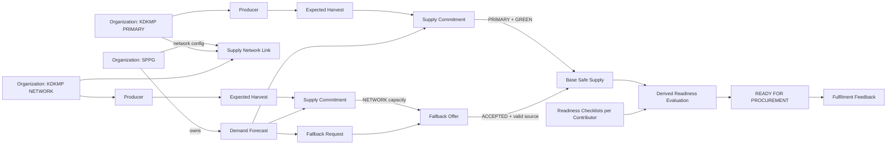

# SIAGAPASOK

## Entity Relationship Diagram (ERD) Specification

**Pre-Procurement Supply Orchestration System untuk Rantai Pasok MBG**

> **STATUS DOKUMEN**  
> DRAFT FOR REVIEW — Foundation Document 3 of 5.  
> Dokumen ini menerjemahkan `01_SiagaPasok_PRD_V1.md` dan `02_SiagaPasok_User_Flow_V1.md` menjadi model data konseptual/logikal: entity, relationship, cardinality, ownership, versioning, derived values, state integrity, dan constraint. Dokumen ini **belum** merupakan migration Laravel atau schema SQL final.

| Item | Keputusan |
|---|---|
| Versi | 1.0 |
| Tanggal | 9 Agustus 2026 |
| Dokumen sebelumnya | `01_SiagaPasok_PRD_V1.md`, `02_SiagaPasok_User_Flow_V1.md` |
| Dokumen berikutnya | `04_SiagaPasok_Design_System_V1.md` |
| Target | Working MVP lokal untuk demonstrasi BEC4 2026 |
| Database direction | Relational database; schema final diputuskan pada implementation plan |
| Scope organisasi | SPPG + KDKMP; business user terikat ke satu organization |
| Prinsip data | Organization-scoped, audit-first, maker-checker, no false Safe Supply |
| Prinsip RFP | Fully derived; bukan kolom/toggle manual |

---

# 1. Tujuan Dokumen

ERD ini memastikan seluruh flow yang sudah dikunci dapat direpresentasikan secara konsisten tanpa menghasilkan:

1. producer data leakage antar-KDKMP;
2. direct calculation dari Expected Harvest ke Safe Supply;
3. approved payload yang diedit in-place;
4. self-approval;
5. stale/risky supply tetap dianggap aman;
6. phantom fallback supply;
7. double reservation/double allocation;
8. Ready for Procurement palsu karena menyimpan status historis sebagai source of truth;
9. dokumen/checklist lama tetap dianggap valid setelah direvisi atau expired;
10. farmer reliability score atau fitur di luar boundary SiagaPasok.

## 1.1 Hierarki Keputusan

Jika terdapat konflik pada tahap implementasi, gunakan urutan berikut:

1. keputusan eksplisit pengguna;
2. `01_SiagaPasok_PRD_V1.md`;
3. `02_SiagaPasok_User_Flow_V1.md`;
4. Final Concept Blueprint / Final Essay Architecture;
5. audit riset dan audit logika sebagai evidence pendukung.

## 1.2 Bukan Migration Specification

Nama field di dokumen ini adalah **logical field names**. Implementasi boleh menyesuaikan penamaan Laravel convention selama makna dan invariants tidak berubah.

Tidak ada migration, model, controller, route, atau kode yang dibuat pada tahap ini.

---

# 2. Prinsip Pemodelan Data

## 2.1 Organization Is the Security Boundary

Semua operational record KDKMP harus dapat ditelusuri ke `organization_id` secara langsung atau melalui relasi yang tidak ambigu.

- SPPG tidak memiliki akses producer-level.
- KDKMP A tidak dapat membaca producer/harvest/commitment internal KDKMP B.
- System Admin dapat mengelola identitas organization/user, tetapi bukan operational supply payload.

## 2.2 Derived Values Are Not Stored as Business Truth

Nilai berikut **tidak menjadi source-of-truth column**:

- Safe Supply;
- At-Risk Supply;
- Coverage %;
- Shortfall;
- Surplus;
- Volume Ready;
- Contributor status;
- Ready for Procurement.

Nilai tersebut dihitung dari state terbaru entity sumber.

Cache/materialized view dapat dipertimbangkan kelak untuk performa, tetapi tidak boleh menjadi authority utama.

## 2.3 Approved Business Payload Is Immutable

Payload commitment dan readiness yang sudah disetujui tidak diedit langsung.

Perubahan menggunakan:

- version baru;
- approval baru;
- audit trail baru.

## 2.4 Conservative Supply Truth

Hanya supply yang memenuhi seluruh syarat valid yang masuk Safe Supply.

`Expected Harvest` tidak pernah dihitung.

`YELLOW` tidak pernah dihitung ke Safe Supply.

`RED` tidak pernah dihitung.

Fallback hanya dihitung jika `ACCEPTED` dan underlying source masih valid.

## 2.5 No Hard-Coded MBG Operational Numbers

ERD tidak membuat field/constraint yang mengunci:

- kapasitas 2.500/3.000 porsi;
- H-30/H-7/H-2;
- 375 kg kangkung;
- threshold severity tertentu;
- NIB/NPWP/SLHS sebagai requirement universal untuk semua actor.

Parameter yang berubah disimpan sebagai data/configuration, bukan hukum schema.

---

# 3. Keputusan ERD Kritis

| ID | Keputusan | Alasan |
|---|---|---|
| ERD-D01 | `users.organization_id` digunakan untuk business user MVP; System Admin boleh `organization_id = NULL`. | One user = one organization, tanpa membuat membership model yang belum dibutuhkan. |
| ERD-D02 | Relasi SPPG–KDKMP dimodelkan melalui `supply_network_links`. | Dibutuhkan untuk menentukan PRIMARY aggregator dan KDKMP network yang boleh melihat fallback broadcast. |
| ERD-D03 | Untuk MVP, satu SPPG memiliki tepat satu KDKMP `PRIMARY`; KDKMP lain dapat `NETWORK`. | Membuat base Safe Supply vs fallback capacity dapat dihitung tanpa ambiguity. |
| ERD-D04 | Supply Commitment dipisah menjadi logical envelope + immutable `commitment_versions`. | Mendukung revision tanpa mengubah approved payload lama. |
| ERD-D05 | Current confidence disimpan pada logical commitment; history disimpan pada `commitment_confidence_events`. | Confidence adalah kondisi commitment yang berubah lebih cepat daripada payload volume. |
| ERD-D06 | Recovery YELLOW→GREEN menggunakan entity approval sendiri. | Menjaga asymmetric approval dan maker-checker. |
| ERD-D07 | Fallback Offer wajib memiliki `fallback_offer_sources`. | Menjamin offer benar-benar dibackup oleh supply internal dan dapat diaudit sampai source commitment. |
| ERD-D08 | Capacity reservation dilakukan pada source commitment, bukan angka bebas organization. | Mencegah phantom supply dan double allocation dengan traceability yang eksplisit. |
| ERD-D09 | Partial acceptance disimpan sebagai `accepted_volume`; state Offer tetap terminal `ACCEPTED`. | Tidak perlu state PARTIALLY_ACCEPTED. |
| ERD-D10 | Partial recovery tidak membuat state request baru; request tetap `OPEN` selama accepted volume belum memenuhi target request. | Sesuai User Flow V1. |
| ERD-D11 | Logistics dan Document Readiness menggunakan checklist versioning. | Revisi setelah approval harus menginvalidasi approval lama tanpa menghapus history. |
| ERD-D12 | Readiness requirement dibuat configurable melalui master requirement. | Tidak mengklaim satu checklist nasional yang statis. |
| ERD-D13 | Document metadata dipisahkan dari checklist. | Dokumen organization-level dapat dipakai kembali lintas forecast selama masih valid. |
| ERD-D14 | Fulfilment Feedback menyimpan snapshot planned volume. | Plan-vs-actual harus tetap historis walau state supply berubah setelah periode selesai. |
| ERD-D15 | Tidak ada entity `farmer_score`, `purchase_order`, `invoice`, `payment`, `vendor_bid`, atau `physical_qc`. | Menjaga system boundary. |

> **Catatan penting ERD-D03**  
> `PRIMARY` vs `NETWORK` adalah keputusan pemodelan untuk membuat User Flow dapat dihitung secara deterministik. `PRIMARY` adalah KDKMP yang menangani supply plan utama forecast SPPG; `NETWORK` adalah KDKMP lokal lain yang dapat menyiapkan kapasitas dan merespons fallback. Ini bukan vendor ranking dan bukan keputusan procurement.

---

# 4. Domain Grouping

Entity dikelompokkan menjadi enam domain.

| Domain | Entity |
|---|---|
| Identity & Organization | `organizations`, `users`, `supply_network_links` |
| Master & Demand | `units`, `commodities`, `demand_forecasts` |
| Local Supply | `producers`, `expected_harvests`, `supply_commitments`, `commitment_versions`, `commitment_confidence_events`, `confidence_recovery_requests` |
| Fallback Recovery | `fallback_requests`, `fallback_offers`, `fallback_offer_sources` |
| Readiness & Closure | `readiness_requirements`, `readiness_checklists`, `readiness_items`, `document_records`, `fulfilment_feedbacks` |
| Platform Control | `notifications`, `audit_logs` |

Total core logical entities: **20**.

---

# 5. High-Level Relationship Map



---

# 6. ERD — Identity, Organization, Network, Demand

```mermaid
erDiagram
    ORGANIZATIONS ||--o{ USERS : has
    ORGANIZATIONS ||--o{ SUPPLY_NETWORK_LINKS : "SPPG side"
    ORGANIZATIONS ||--o{ SUPPLY_NETWORK_LINKS : "KDKMP side"
    ORGANIZATIONS ||--o{ DEMAND_FORECASTS : owns
    COMMODITIES ||--o{ DEMAND_FORECASTS : requested_as
    UNITS ||--o{ COMMODITIES : default_unit
    UNITS ||--o{ DEMAND_FORECASTS : measured_in

    ORGANIZATIONS {
        id PK
        code UK
        name
        organization_type
        is_active
        general_location
        created_at
        updated_at
    }

    USERS {
        id PK
        organization_id FK
        name
        email UK
        password_hash
        role
        is_active
        last_login_at
        created_at
        updated_at
    }

    SUPPLY_NETWORK_LINKS {
        id PK
        sppg_organization_id FK
        kdkmp_organization_id FK
        network_role
        is_active
        configured_by FK
        created_at
        updated_at
    }

    UNITS {
        id PK
        code UK
        name
        symbol
        decimal_precision
        is_active
    }

    COMMODITIES {
        id PK
        code UK
        name
        default_unit_id FK
        harvest_behavior
        notes
        is_active
    }

    DEMAND_FORECASTS {
        id PK
        sppg_organization_id FK
        commodity_id FK
        unit_id FK
        forecast_code UK
        target_volume
        required_start_at
        required_end_at
        freshness_interval_hours
        status
        notes
        published_at
        closed_at
        cancelled_at
        cancellation_reason
        version
        created_by FK
        updated_by FK
        created_at
        updated_at
    }
```

---

# 7. ERD — Producer, Expected Harvest, Commitment & Confidence

```mermaid
erDiagram
    ORGANIZATIONS ||--o{ PRODUCERS : owns
    PRODUCERS ||--o{ EXPECTED_HARVESTS : has
    COMMODITIES ||--o{ EXPECTED_HARVESTS : estimated_for
    UNITS ||--o{ EXPECTED_HARVESTS : measured_in

    DEMAND_FORECASTS ||--o{ SUPPLY_COMMITMENTS : targets
    ORGANIZATIONS ||--o{ SUPPLY_COMMITMENTS : owns
    PRODUCERS ||--o{ SUPPLY_COMMITMENTS : source
    EXPECTED_HARVESTS o|--o{ SUPPLY_COMMITMENTS : informs
    COMMODITIES ||--o{ SUPPLY_COMMITMENTS : commodity

    SUPPLY_COMMITMENTS ||--o{ COMMITMENT_VERSIONS : versions
    SUPPLY_COMMITMENTS ||--o{ COMMITMENT_CONFIDENCE_EVENTS : confidence_history
    SUPPLY_COMMITMENTS ||--o{ CONFIDENCE_RECOVERY_REQUESTS : recovery

    PRODUCERS {
        id PK
        organization_id FK
        producer_code
        name
        village
        district
        contact_phone
        notes
        is_active
        created_by FK
        created_at
        updated_at
    }

    EXPECTED_HARVESTS {
        id PK
        organization_id FK
        producer_id FK
        commodity_id FK
        unit_id FK
        expected_min_volume
        expected_max_volume
        harvest_start_at
        harvest_end_at
        notes
        last_updated_by FK
        created_at
        updated_at
    }

    SUPPLY_COMMITMENTS {
        id PK
        forecast_id FK
        organization_id FK
        producer_id FK
        expected_harvest_id FK
        commodity_id FK
        active_version_id FK
        lifecycle_status
        current_confidence
        last_confidence_verified_at
        created_by FK
        cancelled_at
        cancellation_reason
        expired_at
        created_at
        updated_at
    }

    COMMITMENT_VERSIONS {
        id PK
        commitment_id FK
        version_no
        min_volume
        max_volume
        unit_id FK
        availability_start_at
        availability_end_at
        approval_status
        change_reason
        operator_justification
        created_by FK
        submitted_by FK
        submitted_at
        reviewed_by FK
        reviewed_at
        review_reason
        approved_at
        created_at
    }

    COMMITMENT_CONFIDENCE_EVENTS {
        id PK
        commitment_id FK
        from_confidence
        to_confidence
        source
        reason_code
        reason_note
        actor_user_id FK
        occurred_at
    }

    CONFIDENCE_RECOVERY_REQUESTS {
        id PK
        commitment_id FK
        commitment_version_id FK
        status
        recovery_reason
        requested_by FK
        requested_at
        reviewed_by FK
        reviewed_at
        review_reason
    }
```

---

# 8. ERD — Fallback Recovery

```mermaid
erDiagram
    DEMAND_FORECASTS ||--o{ FALLBACK_REQUESTS : has
    ORGANIZATIONS ||--o{ FALLBACK_REQUESTS : requester
    FALLBACK_REQUESTS ||--o{ FALLBACK_OFFERS : receives
    ORGANIZATIONS ||--o{ FALLBACK_OFFERS : supplier
    FALLBACK_OFFERS ||--o{ FALLBACK_OFFER_SOURCES : backed_by
    SUPPLY_COMMITMENTS ||--o{ FALLBACK_OFFER_SOURCES : source

    FALLBACK_REQUESTS {
        id PK
        forecast_id FK
        requester_organization_id FK
        requested_volume
        unit_id FK
        response_deadline_at
        status
        broadcast_note
        created_by FK
        submitted_by FK
        submitted_at
        reviewed_by FK
        reviewed_at
        review_reason
        opened_at
        fulfilled_at
        cancelled_at
        cancellation_reason
        expired_at
        created_at
        updated_at
    }

    FALLBACK_OFFERS {
        id PK
        fallback_request_id FK
        supplier_organization_id FK
        offered_volume
        accepted_volume
        unit_id FK
        availability_note
        expires_at
        status
        created_by FK
        submitted_by FK
        submitted_at
        supplier_reviewed_by FK
        supplier_reviewed_at
        supplier_review_reason
        requester_decided_by FK
        requester_decided_at
        requester_decision_reason
        withdrawn_by FK
        withdrawn_at
        withdrawal_reason
        created_at
        updated_at
    }

    FALLBACK_OFFER_SOURCES {
        id PK
        fallback_offer_id FK
        supply_commitment_id FK
        reserved_volume
        allocated_volume
        released_volume
        reserved_at
        allocated_at
        released_at
    }
```

---

# 9. ERD — Readiness, Documents, Fulfilment, Platform Control

```mermaid
erDiagram
    DEMAND_FORECASTS ||--o{ READINESS_CHECKLISTS : evaluated_for
    ORGANIZATIONS ||--o{ READINESS_CHECKLISTS : contributor
    READINESS_CHECKLISTS ||--o{ READINESS_ITEMS : contains
    READINESS_REQUIREMENTS ||--o{ READINESS_ITEMS : defines
    ORGANIZATIONS ||--o{ DOCUMENT_RECORDS : owns
    READINESS_REQUIREMENTS o|--o{ DOCUMENT_RECORDS : document_type
    DOCUMENT_RECORDS o|--o{ READINESS_ITEMS : evidence

    DEMAND_FORECASTS ||--o{ FULFILMENT_FEEDBACKS : closes
    ORGANIZATIONS ||--o{ FULFILMENT_FEEDBACKS : contributor

    USERS ||--o{ NOTIFICATIONS : receives
    USERS o|--o{ AUDIT_LOGS : acts
    ORGANIZATIONS o|--o{ AUDIT_LOGS : actor_org

    READINESS_REQUIREMENTS {
        id PK
        readiness_type
        requirement_code UK
        label
        requirement_scope
        applies_to_organization_type
        commodity_id FK
        is_required_default
        is_active
        sort_order
        config_json
    }

    READINESS_CHECKLISTS {
        id PK
        forecast_id FK
        organization_id FK
        readiness_type
        version_no
        supersedes_checklist_id FK
        status
        is_current_version
        prepared_by FK
        submitted_by FK
        submitted_at
        reviewed_by FK
        reviewed_at
        review_reason
        approved_at
        created_at
        updated_at
    }

    READINESS_ITEMS {
        id PK
        readiness_checklist_id FK
        requirement_id FK
        is_required
        is_satisfied
        note
        document_record_id FK
        value_json
        updated_by FK
        updated_at
    }

    DOCUMENT_RECORDS {
        id PK
        organization_id FK
        requirement_id FK
        document_name
        reference_number
        valid_from
        expires_at
        status
        notes
        created_by FK
        created_at
        updated_at
    }

    FULFILMENT_FEEDBACKS {
        id PK
        forecast_id FK
        contributor_organization_id FK
        unit_id FK
        planned_volume_snapshot
        delivered_volume
        fulfilment_date
        result
        reason_note
        recorded_by FK
        recorded_at
        created_at
    }

    NOTIFICATIONS {
        id PK
        recipient_user_id FK
        notification_type
        priority
        title
        message
        related_entity_type
        related_entity_id
        read_at
        created_at
    }

    AUDIT_LOGS {
        id PK
        actor_user_id FK
        actor_role_snapshot
        actor_organization_id FK
        source
        action
        entity_type
        entity_id
        previous_value_json
        new_value_json
        reason_note
        occurred_at
    }
```

---

# 10. Entity Dictionary

# 10.1 `organizations`

Mewakili SPPG atau KDKMP sebagai tenant/business boundary utama.

| Field | Logical Type | Required | Rule |
|---|---|---:|---|
| `id` | PK | Yes | Internal identifier. |
| `code` | String | Yes | Unique immutable-ish display/reference code. |
| `name` | String | Yes | Nama organisasi. |
| `organization_type` | Enum | Yes | `SPPG` / `KDKMP`. |
| `is_active` | Boolean | Yes | Deactivation lebih diutamakan daripada hard delete. |
| `general_location` | String | No | Lokasi umum; tidak perlu geocoordinate presisi untuk MVP. |

**Business constraints:**

- Organization dengan operational records tidak di-hard-delete.
- Organization type tidak diubah ketika masih memiliki active operational data.

---

# 10.2 `users`

Account tertutup yang dibuat administrator.

| Field | Logical Type | Required | Rule |
|---|---|---:|---|
| `organization_id` | FK | Conditional | Wajib untuk SPPG/KDKMP user; `NULL` hanya untuk `SYSTEM_ADMIN`. |
| `name` | String | Yes | Nama user. |
| `email` | String | Yes | Unique. |
| `role` | Enum | Yes | `SYSTEM_ADMIN`, `SPPG_USER`, `KDKMP_OPERATOR`, `KDKMP_MANAGER`. |
| `is_active` | Boolean | Yes | Account inactive tidak dapat login/approve. |

**Role integrity:**

- `SPPG_USER` → organization type harus `SPPG`.
- `KDKMP_OPERATOR` / `KDKMP_MANAGER` → organization type harus `KDKMP`.
- `SYSTEM_ADMIN` → tidak memiliki operational organization context.

---

# 10.3 `supply_network_links`

Administrative relation yang mendefinisikan jaringan lokal SPPG–KDKMP.

| Field | Logical Type | Required | Rule |
|---|---|---:|---|
| `sppg_organization_id` | FK | Yes | Harus organization type SPPG. |
| `kdkmp_organization_id` | FK | Yes | Harus organization type KDKMP. |
| `network_role` | Enum | Yes | `PRIMARY` / `NETWORK`. |
| `is_active` | Boolean | Yes | Hanya active link dipakai forecast baru/aktif. |
| `configured_by` | FK User | Yes | System Admin. |

**MVP rule:** satu SPPG memiliki tepat satu active `PRIMARY` KDKMP.

`NETWORK` KDKMP dapat melihat fallback broadcast dan menyiapkan source-backed supply tetapi supply mereka **tidak langsung** masuk base Safe Supply sampai diterima melalui fallback.

**Guardrail:** network role tidak boleh diubah selama terdapat `PUBLISHED` forecast yang masih menggunakan relation tersebut. Ini mencegah kalkulasi historis berubah karena konfigurasi admin.

---

# 10.4 `units`

Master unit pengukuran.

MVP dapat seed `kg`. Tidak ada automatic unit conversion di core MVP.

Semua volume yang dibandingkan dalam satu forecast harus memakai unit kompatibel/sama.

---

# 10.5 `commodities`

Master komoditas.

Minimal seed demo:

- Kangkung;
- Bayam;
- Kacang Panjang.

`harvest_behavior` bersifat metadata opsional seperti `SINGLE` / `RECURRING`; field ini **tidak** memengaruhi Safe Supply calculation pada MVP.

---

# 10.6 `demand_forecasts`

Demand owner record milik SPPG.

| Field | Logical Type | Required | Rule |
|---|---|---:|---|
| `sppg_organization_id` | FK | Yes | Owner forecast. |
| `commodity_id` | FK | Yes | Satu forecast MVP = satu commodity. |
| `unit_id` | FK | Yes | Unit target volume. |
| `target_volume` | Decimal | Yes | `> 0`; input langsung SPPG. |
| `required_start_at` | DateTime/Date | Yes | Awal requirement window. |
| `required_end_at` | DateTime/Date | Yes | `>= required_start_at`. |
| `freshness_interval_hours` | Integer | No | Configurable; bukan 7 hari hard-coded. |
| `status` | Enum | Yes | `DRAFT`, `PUBLISHED`, `CLOSED`, `CANCELLED`. |
| `version` | Integer | Yes | Optimistic concurrency untuk update/revision forecast. |
| `cancellation_reason` | Text | Conditional | Wajib bila cancelled. |

**Tidak ada field:**

- `safe_supply`;
- `coverage_percent`;
- `shortfall`;
- `volume_ready`;
- `is_ready_for_procurement`.

Semua nilai tersebut derived.

---

# 10.7 `producers`

Internal registry KDKMP.

| Field | Rule |
|---|---|
| `organization_id` | Selalu KDKMP owner. |
| `producer_code` | Unique minimal dalam organization. |
| `name` | Internal-only. |
| `village`, `district` | General location untuk koordinasi internal. |
| `contact_phone` | Optional; tidak pernah dibroadcast. |
| `is_active` | Inactive producer tidak dapat menjadi source commitment baru. |

Tidak ada farmer login dan tidak ada farmer score.

NIB/NPWP tidak dimodelkan sebagai mandatory producer columns; bila relevan, gunakan configurable `document_records`.

---

# 10.8 `expected_harvests`

Estimasi panen internal.

| Field | Rule |
|---|---|
| `producer_id` | Producer milik organization yang sama. |
| `commodity_id` | Komoditas estimasi. |
| `expected_min_volume`, `expected_max_volume` | `0 < min <= max`. |
| `harvest_start_at`, `harvest_end_at` | Window estimasi. |
| `last_updated_by` | KDKMP Operator. |

**Important:**

- Editable tanpa Manager approval.
- Tidak pernah masuk Safe Supply.
- Tidak ada yield calculation otomatis dari luas lahan.
- Proposed commitment di atas expected range menghasilkan soft warning + justification, bukan DB hard block.

---

# 10.9 `supply_commitments`

Logical envelope untuk satu commitment producer terhadap satu forecast.

Satu record tetap menjadi identitas bisnis commitment sepanjang revision cycle.

| Field | Rule |
|---|---|
| `forecast_id` | Forecast target. |
| `organization_id` | KDKMP owner. |
| `producer_id` | Source producer. |
| `expected_harvest_id` | Optional traceability ke expected harvest. |
| `commodity_id` | Harus sama dengan forecast commodity. |
| `active_version_id` | Version terakhir yang approved. `NULL` sebelum approval pertama. |
| `lifecycle_status` | `ACTIVE`, `CANCELLED`, `EXPIRED`. |
| `current_confidence` | `GREEN`, `YELLOW`, `RED`; `NULL` sebelum approval pertama. |
| `last_confidence_verified_at` | Digunakan untuk stale evaluation. |

**Why envelope + versions?**

Karena:

- initial draft dapat berubah sebelum approval;
- approved version tidak boleh diubah;
- revision baru dapat pending sementara approved version lama tetap tercatat;
- saat risiko diketahui, confidence envelope langsung YELLOW/RED sehingga approved volume lama berhenti menjadi Safe Supply;
- revision approval dapat mengganti active version tanpa menghapus version lama.

---

# 10.10 `commitment_versions`

Immutable payload version.

| Field | Rule |
|---|---|
| `commitment_id` | Parent logical commitment. |
| `version_no` | Unique per commitment, mulai dari 1. |
| `min_volume`, `max_volume` | `0 < min <= max`. |
| `unit_id` | Harus compatible dengan forecast. |
| `availability_start_at`, `availability_end_at` | Harus overlap dengan requirement yang logis. |
| `approval_status` | `DRAFT`, `PENDING_APPROVAL`, `APPROVED`, `REJECTED`. |
| `change_reason` | Required untuk revision version. |
| `operator_justification` | Required jika melewati Expected Harvest soft warning. |
| `created_by` | Operator maker. |
| `reviewed_by` | Manager checker. |

**Approval behavior:**

### Initial Version

`PENDING_APPROVAL → APPROVED`

- set `supply_commitments.active_version_id` ke version ini;
- set current confidence `GREEN`;
- set `last_confidence_verified_at`.

### Revision Version

Sebelum submit revision akibat perubahan supply:

- active commitment harus sudah YELLOW/RED sesuai kondisi;
- old approved payload tetap immutable;
- new version `PENDING_APPROVAL`.

Jika revision approved:

- `active_version_id` berganti ke version baru;
- confidence **tidak otomatis GREEN** kecuali recovery approval juga valid.

Jika revision rejected:

- old active version tetap historical active payload;
- confidence tetap YELLOW/RED sesuai kondisi terbaru.

---

# 10.11 `commitment_confidence_events`

Domain event timeline untuk perubahan confidence.

Contoh:

- GREEN → YELLOW karena cuaca;
- GREEN → RED karena gagal panen;
- GREEN → YELLOW oleh system karena stale;
- YELLOW → GREEN setelah approved recovery.

`source` = `USER` atau `SYSTEM`.

Reason wajib untuk downgrade user; system stale menggunakan standardized reason code.

---

# 10.12 `confidence_recovery_requests`

Maker-checker entity khusus untuk peningkatan confidence.

Lifecycle:

`PENDING_APPROVAL → APPROVED / REJECTED`

Rules:

- hanya commitment current confidence `YELLOW` yang boleh memiliki active recovery request;
- requester = KDKMP Operator;
- reviewer = Manager dari organization yang sama;
- maker ≠ checker;
- approval membuat current confidence `GREEN` hanya jika active commitment version masih valid dan capacity integrity lulus;
- RED tidak boleh mempunyai recovery request.

**Fallback integrity check saat recovery:** bila commitment sedang membackup accepted fallback, recovery ke GREEN hanya boleh disetujui jika active minimum volume masih cukup terhadap seluruh active allocated fallback volume yang berasal dari commitment tersebut.

---

# 10.13 `fallback_requests`

Permintaan recovery oleh KDKMP PRIMARY/requester.

| Field | Rule |
|---|---|
| `forecast_id` | Forecast yang mengalami shortfall. |
| `requester_organization_id` | Harus KDKMP `PRIMARY` pada network SPPG forecast. |
| `requested_volume` | `>0` dan tidak boleh melebihi logical shortfall pada saat submit. |
| `response_deadline_at` | Harus sebelum/di operational boundary required period. |
| `status` | `DRAFT`, `PENDING_APPROVAL`, `OPEN`, `REJECTED`, `FULFILLED`, `EXPIRED`, `CANCELLED`. |
| `broadcast_note` | Hanya note aman; tidak berisi producer-sensitive data. |

**Derived:**

`accepted_request_volume = Σ accepted_volume dari offers ACCEPTED`

`remaining_request_volume = max(0, requested_volume - accepted_request_volume)`

Request tetap `OPEN` ketika `remaining_request_volume > 0`.

Request menjadi `FULFILLED` ketika remaining = 0.

Jika accepted fallback kemudian degrade, request terminal **tidak dibuka kembali**. Current Forecast Shortfall dapat muncul lagi dan recovery menggunakan request baru.

---

# 10.14 `fallback_offers`

Offer supplier organization sebagai respons terhadap one fallback request.

| Field | Rule |
|---|---|
| `supplier_organization_id` | KDKMP network yang bukan requester. |
| `offered_volume` | `>0`; harus sama dengan jumlah reserved source volume ketika AVAILABLE. |
| `accepted_volume` | Default 0; setelah Accept `0 < accepted <= offered`. |
| `expires_at` | Tidak boleh melewati request response deadline / operational boundary. |
| `status` | `DRAFT`, `PENDING_APPROVAL`, `AVAILABLE`, `ACCEPTED`, `REJECTED`, `WITHDRAWN`, `EXPIRED`. |

Rules:

- Operator supplier creates/submits.
- Manager supplier approves to AVAILABLE.
- Requester Manager Accept/Reject.
- Supplier Manager boleh Withdraw sebelum acceptance.
- ACCEPTED terminal secara keputusan alokasi.
- Partial acceptance menggunakan `accepted_volume`; sisa reserve dilepas.
- ACCEPTED tidak berarti underlying supply selalu GREEN.

---

# 10.15 `fallback_offer_sources`

Junction/entity yang membuktikan asal kapasitas fallback.

Satu Offer dapat memakai beberapa commitment source; satu commitment dapat menjadi source beberapa offer **selama total reservation/allocation tidak melampaui eligible volume**.

| Field | Rule |
|---|---|
| `fallback_offer_id` | Parent offer. |
| `supply_commitment_id` | Commitment KDKMP supplier. |
| `reserved_volume` | Volume locked ketika offer AVAILABLE. |
| `allocated_volume` | Bagian yang benar-benar allocated ketika offer ACCEPTED. |
| `released_volume` | Reserve yang dilepas pada partial accept/reject/withdraw/expiry. |

**Eligible source rule:**

Source commitment harus:

1. milik supplier organization;
2. commodity sama dengan forecast;
3. memiliki active approved version;
4. confidence `GREEN` pada saat reservation;
5. lifecycle `ACTIVE`;
6. availability window compatible;
7. berasal dari KDKMP `NETWORK` untuk forecast SPPG dalam MVP;
8. memiliki remaining unreserved minimum capacity yang cukup.

**Atomic invariant:**

`Σ(active_reserved + active_allocated)` untuk satu source commitment tidak boleh melebihi active version `min_volume`.

Approval Offer hanya berhasil jika seluruh source reservation berhasil dalam satu transaction boundary.

---

# 10.16 `readiness_requirements`

Configurable master requirement, bukan hard-coded regulasi nasional.

| Field | Rule |
|---|---|
| `readiness_type` | `LOGISTICS` / `DOCUMENT`. |
| `requirement_code` | Stable key. |
| `label` | Bahasa Indonesia utama. |
| `requirement_scope` | `ORGANIZATION` / `FORECAST`. |
| `applies_to_organization_type` | Umumnya KDKMP. |
| `commodity_id` | Nullable untuk commodity-specific requirement. |
| `is_required_default` | Default checklist behavior; dapat dikonfigurasi. |
| `config_json` | Metadata non-critical; tidak berisi executable business logic. |

Contoh seed Logistics:

- pickup schedule confirmed;
- transport vehicle available;
- logistics PIC available;
- packaging/container available;
- delivery time feasible.

Contoh Document requirement seed tidak diklaim universal dan dapat diganti.

---

# 10.17 `readiness_checklists`

Satu checklist version untuk satu `forecast + contributor organization + readiness type`.

| Field | Rule |
|---|---|
| `version_no` | Incremental per forecast/org/type. |
| `supersedes_checklist_id` | Reference version sebelumnya bila revision. |
| `status` | `DRAFT`, `PENDING_APPROVAL`, `APPROVED`, `REJECTED`. |
| `is_current_version` | Hanya current version digunakan untuk readiness evaluation. |
| `prepared_by` / `submitted_by` | Operator. |
| `reviewed_by` | Manager. |

**Revision after approval:**

- jangan edit approved row;
- buat checklist version baru;
- tandai versi baru current;
- sampai versi baru APPROVED, readiness = FALSE;
- old approved version tetap untuk audit/history.

---

# 10.18 `readiness_items`

Snapshot requirement dalam sebuah checklist version.

| Field | Rule |
|---|---|
| `requirement_id` | Master requirement. |
| `is_required` | Snapshot apakah requirement wajib pada checklist ini. |
| `is_satisfied` | Boolean assessment. |
| `note` | Context/exception note. |
| `document_record_id` | Optional; terutama untuk document readiness. |
| `value_json` | Optional structured value; tidak boleh menjadi tempat menyimpan logic tersembunyi. |

Checklist tidak dapat APPROVED bila required items belum satisfied/valid.

---

# 10.19 `document_records`

Metadata dokumen yang dimiliki organization.

Tujuannya bukan document management system kompleks.

| Field | Rule |
|---|---|
| `organization_id` | KDKMP owner. |
| `requirement_id` | Requirement document yang direpresentasikan. |
| `reference_number` | Optional. |
| `valid_from`, `expires_at` | Optional sesuai jenis dokumen. |
| `status` | `VALID`, `EXPIRED`, `REVOKED`, `PENDING` atau equivalent. |
| `notes` | Metadata. |

Actual file upload **tidak wajib** untuk MVP; dapat ditambahkan pada implementation plan jika diperlukan demo.

**Document Ready derived validity:** checklist harus APPROVED dan seluruh required document item harus masih valid pada waktu evaluasi/required period.

---

# 10.20 `fulfilment_feedbacks`

Historical feedback setelah official process di luar SiagaPasok.

Satu forecast dapat memiliki satu feedback per contributor organization.

| Field | Rule |
|---|---|
| `forecast_id` | Forecast yang sudah melewati orchestration phase. |
| `contributor_organization_id` | KDKMP contributor. |
| `planned_volume_snapshot` | Snapshot contribution yang direncanakan pada closure/feedback creation. |
| `delivered_volume` | Input SPPG. |
| `fulfilment_date` | Tanggal realisasi. |
| `result` | Derived/validated: `FULFILLED`, `PARTIAL`, `FAILED`. |
| `reason_note` | Wajib untuk PARTIAL/FAILED. |
| `recorded_by` | SPPG User. |

Rule rekomendasi:

- `delivered_volume >= planned_volume_snapshot` → `FULFILLED`;
- `0 < delivered_volume < planned_volume_snapshot` → `PARTIAL`;
- `delivered_volume = 0` → `FAILED`.

Tidak ada score atau penalty otomatis.

---

# 10.21 `notifications`

In-app notifications per user.

Notifikasi hanya pointer/action signal; operational truth tetap berada di domain entity.

Core types:

- approval required;
- confidence degraded / shortfall detected;
- stale data;
- fallback request available;
- fallback offer available;
- offer decision/reserve released;
- readiness requires approval / invalidated;
- RFP reached/lost.

---

# 10.22 `audit_logs`

Append-only generic audit trail.

Required payload:

- actor user;
- actor role snapshot;
- actor organization snapshot;
- source `USER` / `SYSTEM`;
- action;
- entity type/id;
- previous JSON;
- new JSON;
- reason note bila relevan;
- timestamp.

Audit log tidak diedit atau dihapus melalui UI normal.

---

# 11. Cardinality & Ownership Matrix

| Parent | Child | Cardinality | Ownership / Visibility |
|---|---|---|---|
| Organization | User | 1:N | Same organization; admin manages accounts. |
| SPPG Organization | Supply Network Link | 1:N | Administrative configuration. |
| KDKMP Organization | Supply Network Link | 1:N | Can link to SPPG network. |
| SPPG Organization | Demand Forecast | 1:N | SPPG-only write. |
| KDKMP Organization | Producer | 1:N | KDKMP-private. |
| Producer | Expected Harvest | 1:N | KDKMP-private. |
| Forecast | Supply Commitment | 1:N | Detail private to owner KDKMP; SPPG sees aggregate only. |
| Commitment | Commitment Version | 1:N | Immutable version history. |
| Commitment | Confidence Event | 1:N | Owner KDKMP; aggregate effect visible upstream. |
| Commitment | Recovery Request | 1:N | Operator + Manager same KDKMP. |
| Forecast | Fallback Request | 1:N | Broadcast subset visible to network. |
| Fallback Request | Fallback Offer | 1:N | Requester sees aggregate supplier offer. |
| Fallback Offer | Offer Source | 1:N | Source details supplier-only. |
| Commitment | Offer Source | 1:N | Supplier-only. |
| Forecast + Organization | Readiness Checklist | 1:N versions | Contributor KDKMP details; SPPG aggregate status only. |
| Checklist | Readiness Item | 1:N | Contributor-only detail. |
| Organization | Document Record | 1:N | Organization-private. |
| Forecast | Fulfilment Feedback | 1:N contributors | SPPG writes; contributor can view own result. |
| User | Notification | 1:N | Recipient-only. |
| Any Entity | Audit Log | 1:N | Restricted metadata/view policy. |

---

# 12. Derived Calculation Model

# 12.1 Direct Safe Supply

Untuk sebuah Forecast `F`:

```text
Direct Safe Supply(F)
= SUM(active_version.min_volume)
  untuk commitment yang:
  - forecast = F
  - organization adalah KDKMP PRIMARY pada network SPPG F
  - lifecycle = ACTIVE
  - memiliki active approved version
  - current_confidence = GREEN
  - belum melewati availability/required boundary
```

Expected Harvest tidak ikut formula.

# 12.2 At-Risk Supply

```text
At-Risk Supply(F)
= SUM(active_version.min_volume)
  dari commitment PRIMARY yang:
  - active approved
  - current_confidence = YELLOW
```

Ditampilkan terpisah dan tidak mengurangi Shortfall.

# 12.3 Effective Accepted Fallback Supply

Per Offer Source:

```text
Effective Source Contribution
= allocated_volume
  hanya jika:
  - parent Offer = ACCEPTED
  - source commitment lifecycle = ACTIVE
  - source commitment has active approved version
  - source commitment confidence = GREEN
  - time window masih valid
```

Jika source commitment YELLOW/RED, contribution source = 0 sampai recovery valid.

Per Offer:

```text
Effective Offer Contribution
= SUM(Effective Source Contribution)
```

dengan upper bound `accepted_volume`.

Per Forecast:

```text
Accepted Fallback Safe Supply(F)
= SUM(Effective Offer Contribution)
```

# 12.4 Total Safe Supply

```text
Safe Supply(F)
= Direct Safe Supply(F)
+ Accepted Fallback Safe Supply(F)
```

# 12.5 Shortfall

```text
Shortfall(F)
= max(0, Demand Target(F) - Safe Supply(F))
```

# 12.6 Surplus

```text
Surplus(F)
= max(0, Safe Supply(F) - Demand Target(F))
```

# 12.7 Coverage

```text
Coverage(F)
= if Demand Target > 0
  then min(100, Safe Supply / Demand Target * 100)
  else N/A
```

# 12.8 Contributor Organizations

Contributor set adalah organisasi dengan **effective Safe Supply contribution > 0** pada forecast saat evaluasi.

- PRIMARY KDKMP contributor jika Direct Safe Supply > 0.
- NETWORK KDKMP contributor jika Effective Accepted Fallback Supply > 0.

# 12.9 Volume Ready

```text
Volume Ready(F) = Safe Supply(F) >= Demand Target(F)
```

# 12.10 Logistics Ready per Contributor

```text
Logistics Ready(F, Org)
= latest current Logistics checklist status == APPROVED
  AND all required logistics items remain satisfied
```

# 12.11 Document Ready per Contributor

```text
Document Ready(F, Org)
= latest current Document checklist status == APPROVED
  AND all required document items remain satisfied
  AND referenced required documents remain valid
```

# 12.12 Ready for Procurement

```text
Ready for Procurement(F)
= Volume Ready(F)
  AND ContributorSet(F) is not empty
  AND for every contributor Org:
      Logistics Ready(F, Org) == TRUE
      AND Document Ready(F, Org) == TRUE
  AND Forecast status == PUBLISHED
  AND required operational boundary belum lewat
```

**Tidak ada `is_ready_for_procurement` source-of-truth column.**

---

# 13. State Modeling

# 13.1 Forecast State

```text
DRAFT
 ├─> PUBLISHED ─> CLOSED
 │      └─> CANCELLED*  (*hanya jika tidak ada accepted fallback conflict)
 └─> CANCELLED
```

Terminal: `CLOSED`, `CANCELLED`.

# 13.2 Commitment Approval State

Approval state berada pada `commitment_versions`.

```text
DRAFT -> PENDING_APPROVAL -> APPROVED
                      └----> REJECTED
```

Logical commitment lifecycle:

```text
ACTIVE -> CANCELLED
ACTIVE -> EXPIRED
```

Confidence state:

```text
GREEN -> YELLOW -> RED
  |        |
  └------> RED

YELLOW --Recovery Request + Manager Approve--> GREEN
RED = terminal
```

# 13.3 Fallback Request State

```text
DRAFT -> PENDING_APPROVAL -> OPEN -> FULFILLED
                     |        |  \
                     |        |   -> EXPIRED
                     |        -> CANCELLED
                     -> REJECTED
```

Tidak ada `PARTIALLY_FULFILLED`.

# 13.4 Fallback Offer State

```text
DRAFT -> PENDING_APPROVAL -> AVAILABLE -> ACCEPTED
  |             |              |   |  \
  |             -> REJECTED    |   |   -> EXPIRED
  -> WITHDRAWN                 |   -> REJECTED
                               -> WITHDRAWN
```

`ACCEPTED`, `REJECTED`, `WITHDRAWN`, `EXPIRED` terminal.

# 13.5 Readiness Approval State

Per checklist version:

```text
DRAFT -> PENDING_APPROVAL -> APPROVED
                      └----> REJECTED
```

Perubahan setelah APPROVED membuat **version baru**. Old version tidak diedit.

---

# 14. Maker-Checker Enforcement Model

Entity yang membutuhkan maker-checker:

| Entity / Action | Maker | Checker |
|---|---|---|
| Commitment version | KDKMP Operator | KDKMP Manager |
| Confidence recovery | KDKMP Operator | KDKMP Manager |
| Fallback Request broadcast | KDKMP Operator requester | KDKMP Manager requester |
| Fallback Offer publication | KDKMP Operator supplier | KDKMP Manager supplier |
| Logistics Readiness | KDKMP Operator | KDKMP Manager |
| Document Readiness | KDKMP Operator | KDKMP Manager |

Hard rule:

```text
maker_user_id != reviewer_user_id
```

Selain user ID, system harus memastikan kedua user berasal dari organization yang sesuai dengan record.

Manager review payload bersifat read-only.

---

# 15. Fallback Reservation Integrity

Fallback adalah area dengan risiko data tertinggi. ERD menetapkan empat ledger-like volume pada `fallback_offer_sources`:

- `reserved_volume`;
- `allocated_volume`;
- `released_volume`;
- implicit current open reserve = reserved - allocated - released.

## 15.1 Approve to AVAILABLE

Dalam satu atomic transaction:

1. lock/validate source commitments;
2. confirm source GREEN + active approved version;
3. calculate existing active reservation/allocation;
4. ensure new reserve does not exceed current minimum capacity;
5. insert/update source reservation rows;
6. set Offer `AVAILABLE`.

Jika satu source gagal, seluruh transition gagal.

## 15.2 Partial Acceptance

Contoh:

- Offer = 160 kg;
- Request remaining = 150 kg;
- Requester Accept = 150 kg.

Hasil:

- `accepted_volume = 150`;
- source allocation total = 150;
- reserve 10 kg direlease;
- Offer state = `ACCEPTED`;
- Request remaining direcalculate.

## 15.3 Rejection / Withdrawal / Expiry

Semua open reserve dilepas.

## 15.4 Accepted Source Degradation

Offer tetap `ACCEPTED` sebagai historical allocation decision.

Namun bila source commitment menjadi YELLOW/RED:

- effective source contribution menjadi 0;
- Safe Supply requester turun;
- current Forecast Shortfall dapat muncul;
- RFP dapat FALSE;
- old FULFILLED request tidak dibuka kembali otomatis.

---

# 16. Privacy & Row-Level Scope

# 16.1 KDKMP Private Entities

Entity berikut wajib organization-scoped:

- producers;
- expected_harvests;
- supply commitments + versions;
- confidence events/recovery;
- fallback source details;
- readiness checklist items;
- document records.

# 16.2 Broadcast-Safe Fallback Payload

KDKMP NETWORK hanya boleh membaca dari Fallback Request:

- requester organization name/code;
- commodity;
- requested/remaining volume;
- required period/date;
- response deadline;
- safe aggregate note.

Tidak expose:

- producer IDs/names;
- individual commitment volumes;
- phone numbers;
- internal capacity breakdown;
- source document details;
- internal pricing.

# 16.3 SPPG Visibility

SPPG boleh membaca:

- forecast-nya sendiri;
- aggregate Safe Supply;
- At-Risk;
- Shortfall;
- Coverage;
- contributor organization;
- aggregate Logistics/Document readiness state;
- RFP;
- fulfilment feedback.

SPPG tidak mendapat query path langsung ke producer/harvest/source commitment detail.

# 16.4 System Admin Visibility

System Admin operationally hanya membutuhkan:

- organization/user metadata;
- account state;
- platform audit metadata.

Tidak ada admin endpoint untuk mengubah operational supply state atau override RFP.

---

# 17. Auditability Model

Entity domain tetap menyimpan field actor/timestamp penting untuk operational query. `audit_logs` menyimpan generic before/after trail untuk forensics.

Minimum events:

1. organization/user created/deactivated;
2. forecast created/published/revised/cancelled/closed;
3. expected harvest revised;
4. commitment version created/submitted/approved/rejected;
5. commitment cancelled/expired;
6. confidence downgrade;
7. stale auto-downgrade;
8. recovery requested/approved/rejected;
9. fallback request submitted/approved/rejected/cancelled/expired/fulfilled;
10. fallback offer submitted/approved/rejected/withdrawn/expired/accepted;
11. capacity reserved/allocated/released;
12. readiness submitted/approved/rejected/revised;
13. document expired/revoked;
14. RFP derived transition TRUE/FALSE;
15. fulfilment feedback recorded.

RFP itself bukan row mutable, tetapi **transition event** dapat dicatat di `audit_logs` ketika hasil derivasi berubah dari evaluasi sebelumnya.

---

# 18. Concurrency & Version Fields

ERD perlu memberi ruang untuk race-condition protection tanpa mengunci implementation detail.

Recommended entities dengan optimistic version/concurrency token:

- `demand_forecasts`;
- `supply_commitments` logical envelope;
- `fallback_offers`;
- source commitment capacity reservation path;
- readiness current-version selection.

Critical operations yang wajib transactional:

1. Manager approve Fallback Offer → create reserve → AVAILABLE;
2. Requester Accept Offer → allocate accepted → release unused reserve → ACCEPTED;
3. Reject/Withdraw/Expire Offer → release reserve;
4. commitment downgrade yang memengaruhi accepted fallback → recalculate effective supply;
5. readiness version switch setelah approved record direvisi.

Repeated HTTP requests harus idempotent terhadap state transition; second call pada state yang sudah berubah tidak membuat duplicate business record.

---

# 19. Key Constraints & Validation Catalogue

| ID | Constraint | Enforcement |
|---|---|---|
| C01 | `target_volume > 0` | DB/application validation |
| C02 | Expected Harvest `0 < min <= max` | DB/application |
| C03 | Commitment Version `0 < min <= max` | DB/application |
| C04 | Forecast commodity = commitment commodity | Service + FK/domain validation |
| C05 | Producer organization = commitment organization | Authorization/service |
| C06 | Maker ≠ Checker | Service/policy |
| C07 | SPPG User only manages own SPPG forecast | Authorization/policy |
| C08 | KDKMP user cannot access producer rows of other organization | Authorization/query scope |
| C09 | Expected Harvest never enters Safe Supply | Calculation service invariant |
| C10 | Only PRIMARY direct GREEN commitments enter base Safe Supply | Calculation invariant |
| C11 | YELLOW/RED contribution to Safe Supply = 0 | Calculation invariant |
| C12 | RED cannot recover | State machine |
| C13 | Approved commitment version immutable | Service/repository policy |
| C14 | Revision cannot keep old volume safe once known risk exists | Confidence invariant |
| C15 | Fallback request requires Shortfall > 0 at submit/open | Service validation |
| C16 | Request requested volume ≤ current logical shortfall | Service validation |
| C17 | Offer supplier ≠ requester | DB/service validation |
| C18 | Offer cannot be AVAILABLE without complete source reserve | Transaction invariant |
| C19 | Active reservation/allocation ≤ source active minimum volume | Transaction/DB invariant |
| C20 | EXPIRED/REJECTED/WITHDRAWN offer cannot Accept | State machine |
| C21 | Accepted volume ≤ offered volume | DB/application |
| C22 | Accepted volume ≤ remaining request requirement | Transaction validation |
| C23 | Unused reserve released after partial acceptance | Transaction invariant |
| C24 | Accepted offer cannot be withdrawn unilaterally | State machine |
| C25 | Readiness approval requires all required items satisfied | Service rule |
| C26 | Readiness revision creates new version | Service rule |
| C27 | Expired required document makes Document Ready false | Derived validity |
| C28 | RFP has no manual write path | Architecture invariant |
| C29 | Forecast cancel blocked while unresolved Accepted fallback allocation exists | Service rule |
| C30 | Fulfilment feedback does not update farmer/reliability score | Domain boundary |
| C31 | No operational hard delete | Data lifecycle policy |
| C32 | Network role cannot change during active PUBLISHED forecast using link | Admin validation |

---

# 20. Uniqueness Rules

Recommended logical uniqueness:

| Entity | Unique Rule |
|---|---|
| Organizations | `code` |
| Users | `email` |
| Supply Network Link | `(sppg_organization_id, kdkmp_organization_id)` |
| Producer | `(organization_id, producer_code)` |
| Commodity | `code` |
| Unit | `code` |
| Forecast | `forecast_code` |
| Commitment Version | `(commitment_id, version_no)` |
| Active Recovery Request | At most one PENDING per commitment |
| Offer Source | `(fallback_offer_id, supply_commitment_id)` |
| Readiness Requirement | `requirement_code` |
| Readiness Checklist Version | `(forecast_id, organization_id, readiness_type, version_no)` |
| Current Readiness Checklist | At most one current version per `(forecast, organization, type)` |
| Fulfilment Feedback | `(forecast_id, contributor_organization_id)` for MVP |

Exactly one active `PRIMARY` link per SPPG adalah service-level invariant karena conditional uniqueness bergantung pada database implementation.

---

# 21. Indexing Priorities for MVP

Belum merupakan SQL index specification, tetapi query berikut harus diprioritaskan pada implementation plan.

1. Forecast by SPPG + status + required date.
2. Producer by KDKMP organization.
3. Expected Harvest by organization + commodity + harvest window.
4. Commitment by forecast + organization + lifecycle + confidence.
5. Commitment version by commitment + version number/status.
6. Fallback Request by forecast + status + response deadline.
7. Fallback Offer by request + status + supplier.
8. Offer Source by commitment for reservation lookup.
9. Readiness by forecast + organization + type + current version.
10. Document by organization + requirement + expiry.
11. Notifications by recipient + unread.
12. Audit logs by entity type/id + occurred_at.

---

# 22. Data Lifecycle & Deletion Policy

## 22.1 Deactivation Instead of Hard Delete

Use deactivation/archive semantics for:

- organization;
- user;
- producer;
- commodity;
- requirements.

## 22.2 Terminal Operational Records

Tidak dihapus:

- published/cancelled/closed forecast;
- approved/rejected commitment versions;
- confidence events;
- fallback requests/offers;
- readiness approvals;
- fulfilment feedback;
- audit logs.

## 22.3 Demo Reset

Karena MVP dijalankan lokal, demo reset boleh dilakukan melalui fixture/seed reset khusus environment demonstrasi.

Reset demo tidak dianggap feature produksi dan tidak boleh muncul sebagai kemampuan System Admin pada production architecture.

---

# 23. What Is Explicitly NOT in the ERD

Entity berikut **tidak dibuat**:

- `purchase_orders`;
- `invoices`;
- `payments`;
- `loans`;
- `vendor_bids`;
- `marketplace_listings`;
- `farmer_ratings`;
- `farmer_scores`;
- `physical_quality_inspections`;
- `iot_sensor_data`;
- `ai_predictions`;
- `menu_nutrition_calculations`;
- `sIPGN_api_tokens` atau integration tables yang mengasumsikan public API;
- farm agronomy management seperti fertilizer schedule/pesticide schedule.

---

# 24. Core Query Semantics by Role

## 24.1 SPPG Dashboard Query

Source:

`demand_forecasts`
→ derived direct Safe Supply PRIMARY
→ effective accepted fallback
→ contributor set
→ readiness per contributor
→ derived RFP.

Output tidak join producer details ke response SPPG.

## 24.2 KDKMP Operator Dashboard

Scope seluruh query dengan current `organization_id`.

Dapat membaca:

- linked published forecasts;
- own producers;
- own expected harvest;
- own commitments;
- own fallback request jika PRIMARY;
- broadcast request jika NETWORK;
- own offers;
- own readiness;
- own notifications.

## 24.3 KDKMP Manager Dashboard

Same organization scope, dengan fokus queue:

- pending commitment versions;
- pending confidence recovery;
- pending fallback broadcast;
- pending outgoing offer;
- incoming AVAILABLE offer untuk requester PRIMARY;
- pending readiness.

## 24.4 System Admin Dashboard

Tidak melakukan query operational payload untuk decision-making.

Primary entities:

- organizations;
- users;
- supply network links;
- account/audit metadata.

---

# 25. End-to-End Data Mutation Example

Contoh controlled demo untuk menguji seluruh ERD.

## Step 1 — Forecast

SPPG creates:

```text
Forecast F-001
Commodity = Kangkung
Demand Target = 400 kg
Status = PUBLISHED
```

No Safe Supply column ditulis.

## Step 2 — PRIMARY Commitments

KDKMP A memiliki producer commitments approved + GREEN dengan total lower bound 400 kg.

Derived:

```text
Direct Safe Supply = 400
Shortfall = 0
Volume Ready = TRUE
```

## Step 3 — Disruption

Operator membuat confidence event pada dua commitment.

GREEN → YELLOW/RED.

Derived Direct Safe Supply turun ke 250 kg.

```text
Shortfall = 150
Volume Ready = FALSE
RFP = FALSE
```

Tidak ada update manual pada table forecast untuk status ini.

## Step 4 — Fallback Request

KDKMP A:

```text
Fallback Request requested_volume = 150
PENDING_APPROVAL -> OPEN
```

## Step 5 — Supplier Offer

KDKMP B memiliki NETWORK commitments GREEN dengan minimum eligible ≥160 kg.

Operator membuat Offer 160 kg dan source mappings.

Manager approve:

- source rows reserved total 160;
- Offer `AVAILABLE`.

## Step 6 — Partial Accept Against Offer

Manager A accepts 150 kg.

Atomic effects:

- Offer `ACCEPTED`;
- accepted_volume = 150;
- source allocated = 150;
- unused reserve = 10 released;
- Fallback Request `FULFILLED`.

Derived:

```text
Safe Supply = 250 + 150 = 400
Shortfall = 0
Volume Ready = TRUE
```

## Step 7 — Readiness

Current contributor set:

- KDKMP A;
- KDKMP B.

Both must have current APPROVED Logistics and Document checklist.

Only then:

```text
RFP = TRUE
```

## Step 8 — Accepted Source Degrades

Jika source commitment B berubah GREEN → YELLOW:

- Offer tetap ACCEPTED;
- source effective contribution = 0;
- current Safe Supply turun;
- Shortfall muncul;
- RFP FALSE;
- old request tetap FULFILLED;
- new fallback cycle dibuat jika recovery dibutuhkan.

## Step 9 — Fulfilment

Setelah official process selesai, SPPG records feedback per contributor.

Tidak ada PO/payment/QC record di SiagaPasok.

---

# 26. ERD Acceptance Tests

ERD dianggap valid hanya jika seluruh pertanyaan berikut dapat dijawab `YES`.

1. Dapatkah satu SPPG memiliki beberapa forecast tanpa mencampur supply antarforecast?
2. Dapatkah satu KDKMP memiliki banyak producers tanpa bocor ke KDKMP lain?
3. Dapatkah Expected Harvest diubah tanpa menyentuh Safe Supply?
4. Dapatkah commitment approved tetap immutable saat revision baru menunggu approval?
5. Dapatkah confidence turun langsung sebelum revision Manager selesai?
6. Dapatkah YELLOW→GREEN ditahan sampai Manager approve recovery?
7. Dapatkah RED tetap terminal?
8. Dapatkah direct PRIMARY supply dibedakan dari NETWORK fallback capacity?
9. Dapatkah fallback request tetap OPEN saat hanya sebagian target dipenuhi?
10. Dapatkah offer diterima sebagian tanpa membuat state tambahan?
11. Dapatkah unused reserve dilepas setelah partial acceptance?
12. Dapatkah satu offer dibuktikan source-backed?
13. Dapatkah system mencegah satu source volume dialokasikan dua kali?
14. Dapatkah Accepted Offer tetap historical ketika underlying source degrade?
15. Dapatkah effective Safe Supply turun tanpa mengubah commercial ACCEPTED state?
16. Dapatkah contributor set dihitung dinamis?
17. Dapatkah Logistics/Document readiness disimpan per contributor dan forecast?
18. Dapatkah approved readiness direvisi tanpa menimpa history?
19. Dapatkah document expiry membuat Document Ready false secara derived?
20. Dapatkah RFP berubah TRUE→FALSE tanpa manual toggle?
21. Dapatkah forecast cancellation diblokir saat accepted fallback unresolved?
22. Dapatkah SPPG menerima Fulfilment Feedback per contributor tanpa melihat farmer detail?
23. Dapatkah audit trail menyimpan before/after dan actor yang benar?
24. Dapatkah System Admin tetap tidak memiliki supply override path?
25. Apakah schema tetap bebas dari payment, PO, AI, marketplace, dan farmer scoring?

---

# 27. Deferred Database Decisions

Hal-hal berikut sengaja belum dikunci pada ERD dan akan diputuskan pada `05_SiagaPasok_Modular_Implementation_Plan_V1.md`:

- MySQL vs PostgreSQL jika belum ditentukan repo;
- BIGINT vs UUID primary keys;
- exact enum implementation vs lookup table;
- Laravel SoftDeletes usage per entity;
- JSON column vs normalized sub-table untuk minor metadata;
- exact database lock strategy (`SELECT ... FOR UPDATE`, optimistic versioning, atau kombinasi);
- queue/cron implementation;
- notification storage memakai Laravel database notifications atau custom table;
- actual file upload strategy untuk document records;
- cache strategy untuk dashboard derived metrics;
- exact index definitions;
- demo reset implementation.

Keputusan ini tidak boleh mengubah business semantics yang sudah dikunci di ERD.

---

# 28. Traceability ke PRD & User Flow

| ERD Area | PRD/User Flow Source |
|---|---|
| Closed account & role scope | FR-01/02; Sections 5–6 User Flow |
| Demand Forecast | FR-04; UF-SPPG-01 s.d. 06 |
| Producer Registry | FR-05; UF-OP-01 |
| Expected Harvest | FR-06; UF-OP-02/03 |
| Commitment versioning | FR-07; UF-COM; UF-RISK-05 |
| Asymmetric confidence | FR-08; UF-RISK-01 s.d. 04 |
| Derived supply metrics | FR-09; UF-SHORT-01 |
| Fallback Request | FR-10; UF-FR-01 s.d. 04 |
| Source-backed Offer | FR-11; UF-FO-01 s.d. 08 |
| Readiness | FR-12/13; UF-LOG / UF-DOC |
| Multi-supplier RFP | FR-14; UF-RFP-01 s.d. 03 |
| Notifications | FR-15; User Flow Section 18 |
| Audit | FR-16; embedded critical flows |
| Fulfilment | FR-17; UF-FUL-01/02 |
| Demo isolation | FR-18; User Flow Section 22 |

---

# 29. Exit Criteria untuk Dokumen 4 — Design System

ERD V1 dapat dianggap **LOCKED** dan dilanjutkan ke Design System jika keputusan berikut diterima:

1. `organization` menjadi tenant/security boundary utama;
2. business user tetap one user = one organization;
3. relation SPPG–KDKMP menggunakan PRIMARY + NETWORK scope untuk membuat fallback flow deterministik;
4. commitment menggunakan logical envelope + immutable versions;
5. confidence dipisahkan dari volume payload dan memiliki event history;
6. recovery YELLOW→GREEN memiliki maker-checker entity sendiri;
7. fallback request tidak memiliki PARTIALLY_FULFILLED state;
8. fallback offer dapat partial accept melalui `accepted_volume`;
9. fallback offer wajib dibackup `fallback_offer_sources`;
10. capacity reservation/allocation harus atomic;
11. readiness requirement configurable dan checklist versioned;
12. document record dapat organization-level dan tervalidasi waktu;
13. Safe Supply/Coverage/Shortfall/Contributor/Volume Ready/RFP seluruhnya derived;
14. fulfilment feedback disimpan per contributor sebagai historical plan-vs-actual;
15. audit log append-only;
16. tidak ada schema untuk procurement/payment/AI/marketplace/QC/farmer scoring.

> **NEXT DOCUMENT**  
> Setelah ERD ini disetujui, Dokumen 4 adalah `04_SiagaPasok_Design_System_V1.md`, yang akan mengunci prinsip visual, hierarchy, typography, color semantics, shadcn component policy, layout patterns, dashboard density, tables, status badges, forms, approval UX, responsive behavior, dan presentation-demo rules tanpa mulai coding.
