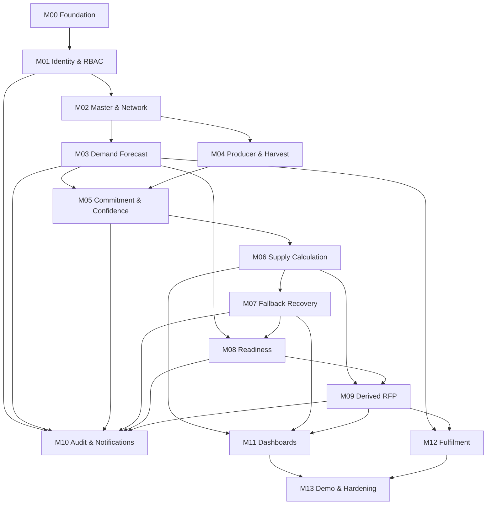

# SIAGAPASOK

## Modular Implementation Plan

**Pre-Procurement Supply Orchestration System untuk Rantai Pasok MBG**

> **STATUS DOKUMEN**  
> DRAFT FOR REVIEW — Foundation Document 5 of 5.  
> Dokumen ini menerjemahkan `01_SiagaPasok_PRD_V1.md`, `02_SiagaPasok_User_Flow_V1.md`, `03_SiagaPasok_ERD_V1.md`, dan `04_SiagaPasok_Design_System_V1.md` menjadi urutan pembangunan modular untuk working MVP. Dokumen ini **bukan source code** dan tidak mengeksekusi migration, model, controller, route, React page, atau instalasi package.

| Item | Keputusan |
|---|---|
| Versi | 1.0 |
| Tanggal | 9 Agustus 2026 |
| Target | Working MVP lokal untuk demonstrasi BEC4 2026 |
| Repository state | Fresh; shadcn/ui belum terpasang |
| Target runtime | Laptop lokal terlebih dahulu |
| Backend | Laravel |
| Frontend | Inertia.js + React + Vite |
| UI component system | shadcn/ui sebagai primary component system |
| Styling | Tailwind CSS utility + tokens dari Design System |
| Authentication | Closed account; tidak ada public registration |
| Data model | Organization-scoped; one user = one organization untuk MVP |
| Business logic | Deterministic; tidak ada AI/ML |
| Procurement boundary | Berhenti pada derived `Ready for Procurement`; procurement resmi tetap di luar SiagaPasok |
| Implementation status | **BELUM DIMULAI** — menunggu persetujuan lima foundation documents |

---

# 1. Tujuan Dokumen

Dokumen ini menentukan **bagaimana SiagaPasok harus dibangun secara bertahap tanpa merusak business rules yang sudah dikunci**.

Tujuan utamanya:

1. memecah sistem menjadi modul yang dapat dibangun dan diuji secara independen;
2. menentukan dependency antar-modul;
3. memastikan business truth berada di backend, bukan hanya di UI;
4. menentukan urutan migration/model/service/policy/page tanpa langsung menulis code;
5. memastikan maker-checker, organization isolation, atomic fallback reservation, dan derived readiness tidak ditambahkan terlambat sebagai patch;
6. menyediakan gate yang jelas sebelum berpindah dari satu milestone ke milestone berikutnya;
7. memastikan demo utility tetap terpisah dari production-like workflow;
8. menjaga scope MVP agar tidak berkembang menjadi marketplace, procurement system, atau farm-management platform.

## 1.1 Hierarki Keputusan

Jika muncul konflik saat implementasi, gunakan urutan otoritas berikut:

1. keputusan eksplisit pengguna;
2. `01_SiagaPasok_PRD_V1.md`;
3. `02_SiagaPasok_User_Flow_V1.md`;
4. `03_SiagaPasok_ERD_V1.md`;
5. `04_SiagaPasok_Design_System_V1.md`;
6. dokumen Modular Implementation Plan ini;
7. convenience teknis framework sebagai pilihan terakhir.

Implementasi **tidak boleh mengubah business rule hanya karena cara lain lebih mudah dikodekan**.

---

# 2. Definition of Done untuk Working MVP

Working MVP dianggap selesai jika pengguna dapat menjalankan alur berikut secara lokal dari browser:

```text
SPPG publishes Forecast
→ KDKMP records Expected Harvest
→ Operator prepares range-based Commitment
→ Manager approves Commitment
→ Safe Supply is calculated
→ Operator downgrades risky Commitment
→ Shortfall appears automatically
→ Requester prepares Fallback Request
→ Requester Manager broadcasts it
→ Supplier prepares source-backed Fallback Offer
→ Supplier Manager approves and reserves capacity atomically
→ Requester Manager accepts all/part of offer
→ Safe Supply/Coverage recalculate
→ Contributor Logistics Readiness is prepared and approved
→ Contributor Document Readiness is prepared and approved
→ Ready for Procurement becomes TRUE automatically
→ later SPPG records Fulfilment Feedback
```

MVP juga dianggap belum selesai bila happy path berjalan tetapi salah satu kondisi berikut masih mungkin terjadi:

- Operator dapat self-approve;
- KDKMP A dapat membaca producer KDKMP B;
- YELLOW masuk Safe Supply;
- Expected Harvest masuk Safe Supply;
- Offer `AVAILABLE` dianggap accepted supply;
- satu surplus dapat di-reserve dua kali;
- Manager requester tidak diperlukan saat Accept fallback;
- RFP dapat di-toggle manual;
- RFP tetap TRUE setelah contributor kehilangan readiness;
- System Admin dapat mengubah operational supply truth;
- demo scenario mengubah data melalui shortcut yang tidak merepresentasikan business event sah.

---

# 3. Prinsip Arsitektur Implementasi

## 3.1 Server Is the Source of Business Truth

React/Inertia menampilkan state; Laravel menentukan state.

Perhitungan berikut wajib berasal dari backend service/domain query:

- Safe Supply;
- At-Risk Supply;
- Shortfall;
- Surplus;
- Coverage;
- contributor organizations;
- Volume Ready;
- Logistics Ready;
- Document Ready;
- Ready for Procurement;
- fallback available/reserved/allocated capacity.

Frontend boleh menghitung preview kosmetik, tetapi tidak boleh menjadi source of truth.

## 3.2 Derived Values Are Not Editable Fields

Jangan membuat write path untuk:

- `safe_supply`;
- `coverage_percent`;
- `shortfall`;
- `volume_ready`;
- `ready_for_procurement`.

Jika cache/performance optimization kelak dibutuhkan, cache harus selalu dianggap hasil derivasi yang dapat direbuild, bukan authoritative business data.

## 3.3 Thin Controllers, Explicit Domain Services

Controller bertugas:

- menerima request;
- authorization;
- memanggil application/domain service;
- mengembalikan redirect/Inertia response.

Business transitions yang kritis tidak diletakkan sebagai rangkaian `if` tersebar di controller atau React component.

## 3.4 Policies Enforce Tenant and Role Boundaries

Authorization harus menjaga dua dimensi sekaligus:

1. **Role** — siapa boleh melakukan aksi;
2. **Organization scope** — data organisasi mana yang boleh disentuh.

Filtering UI bukan security boundary.

## 3.5 State Transitions Are Commands, Not Generic Updates

Contoh yang harus berupa operasi eksplisit:

- Publish Forecast;
- Approve Commitment;
- Reject Commitment;
- Downgrade Confidence;
- Request Recovery;
- Approve Recovery;
- Approve Fallback Broadcast;
- Approve Fallback Offer;
- Accept Fallback Offer;
- Reject Fallback Offer;
- Approve Logistics Readiness;
- Approve Document Readiness.

Hindari endpoint generic `PATCH record` untuk state penting.

## 3.6 Critical Multi-Row Mutations Are Transactional

Operasi berikut wajib dalam database transaction:

- approval offer + reserve capacity;
- accept offer + allocate accepted volume + release remainder;
- reject/withdraw/expire offer + release reserve;
- switching approved readiness version setelah revision;
- confidence change yang memengaruhi accepted fallback contribution;
- any operation yang dapat mengubah supply truth di lebih dari satu aggregate.

## 3.7 No Operational Hard Delete

Gunakan deactivate/archive/terminal state untuk record bisnis. Audit history tidak boleh hilang karena tombol delete.

---

# 4. Rekomendasi Struktur Aplikasi

Struktur final dapat menyesuaikan konvensi repo, tetapi modular boundary yang direkomendasikan adalah:

```text
app/
├── Actions/                 # single-purpose application commands bila diperlukan
├── Enums/                   # domain states/roles/types
├── Http/
│   ├── Controllers/
│   │   ├── Admin/
│   │   ├── Sppg/
│   │   └── Kdkmp/
│   ├── Middleware/
│   └── Requests/
├── Models/
├── Policies/
├── Services/
│   ├── Supply/
│   ├── Commitment/
│   ├── Fallback/
│   ├── Readiness/
│   ├── Audit/
│   └── Notification/
└── Support/

resources/js/
├── Components/
│   ├── ui/                  # shadcn generated components
│   ├── AppShell/
│   ├── Domain/
│   └── Shared/
├── Layouts/
├── Pages/
│   ├── Auth/
│   ├── Admin/
│   ├── Sppg/
│   └── Kdkmp/
├── lib/
└── types/ or domain constants as appropriate

database/
├── factories/
├── migrations/
└── seeders/

tests/
├── Feature/
│   ├── Auth/
│   ├── Authorization/
│   ├── Forecast/
│   ├── Commitment/
│   ├── Fallback/
│   ├── Readiness/
│   └── Fulfilment/
└── Unit/
    └── Supply/
```

### Rule

Tidak perlu memaksakan Domain-Driven Design folder hierarchy yang sangat berat. MVP membutuhkan **explicit services dan state rules**, bukan ceremonial architecture.

---

# 5. Technical Bootstrap Decisions

Sebelum migration pertama dibuat, lakukan **Repository Bootstrap Audit**.

## 5.1 Audit yang Harus Dilakukan

Periksa dan catat:

- versi Laravel;
- versi PHP;
- package manager dan lockfile;
- apakah Inertia sudah terpasang;
- apakah React sudah terpasang;
- apakah Tailwind sudah terpasang;
- apakah auth starter sudah ada;
- database driver lokal yang tersedia;
- testing stack yang sudah menjadi default repo;
- lint/format tools yang sudah ada.

Jangan menginstall duplicate tooling sebelum audit ini selesai.

## 5.2 Frontend Bootstrap Target

Target akhir foundation frontend:

- Inertia + React aktif;
- Vite build sehat;
- Tailwind aktif;
- shadcn/ui terpasang;
- token warna/design system masuk ke theme;
- `Inter` digunakan melalui mekanisme web font/system yang legal dan tidak membutuhkan penyebaran font file internal;
- lucide-react untuk iconography;
- satu AppShell reusable.

## 5.3 Authentication Bootstrap

Gunakan official/compatible Laravel authentication scaffolding yang cocok dengan versi repo saat implementation dilakukan.

Business requirements setelah scaffolding:

- login tersedia;
- registration route/public UI dihapus atau dinonaktifkan;
- forgot password hanya dipertahankan bila sudah tersedia dan tidak menambah scope signifikan;
- user dibuat oleh System Admin;
- user harus mempunyai organization dan role yang valid;
- inactive user tidak dapat login.

## 5.4 Database Engine

Database engine belum dikunci oleh empat dokumen sebelumnya.

**Rekomendasi implementasi:** gunakan MySQL/MariaDB atau PostgreSQL lokal yang mendukung transaksi dan locking dengan baik.

SQLite boleh dipakai untuk isolated unit tests tertentu, tetapi **tidak direkomendasikan sebagai satu-satunya runtime pembuktian fallback concurrency**, karena modul fallback memiliki requirement reservasi atomik dan race-condition protection.

Keputusan engine final harus mengikuti environment laptop dan repo saat implementation dimulai.

---

# 6. Modul Implementasi

Implementasi dibagi menjadi 14 modul.

| Module | Nama | Tujuan |
|---|---|---|
| M00 | Repository & UI Foundation | Membuat stack dan app shell sehat |
| M01 | Identity, Organization & RBAC | Closed account, tenant scope, role authorization |
| M02 | Master Data & Network | Commodity, unit, SPPG–KDKMP network |
| M03 | Demand Forecast | Forecast lifecycle oleh SPPG |
| M04 | Producer & Expected Harvest | Upstream internal visibility |
| M05 | Commitment & Confidence | Maker-checker + risk truth |
| M06 | Supply Calculation | Safe, At-Risk, Shortfall, Coverage, contributors |
| M07 | Fallback Recovery | Broadcast, offer, atomic reserve, accept |
| M08 | Logistics & Document Readiness | Contributor readiness approval |
| M09 | Derived Ready for Procurement | Final multi-supplier gate |
| M10 | Notifications & Audit Trail | Actionability + traceability |
| M11 | Dashboards & Operational UI | Role-specific command centres |
| M12 | Fulfilment Feedback | Post-official-process learning loop |
| M13 | Demo Utility & Hardening | Controlled demo, reset, race/security tests |

---

# 7. Dependency Graph



Tidak semua modul harus menunggu UI modul sebelumnya. Backend service dan tests dapat maju lebih dahulu selama dependency datanya sudah tersedia.

---

# 8. M00 — Repository & UI Foundation

## 8.1 Scope

M00 hanya membuat landasan teknis; tidak memasukkan business data SiagaPasok.

### Tasks

1. audit repository;
2. pastikan Laravel boot sehat;
3. aktifkan Inertia + React bila belum ada;
4. pastikan Vite build berjalan;
5. aktifkan Tailwind bila belum ada;
6. install/configure shadcn/ui;
7. definisikan theme dari Design System;
8. buat app-level layout skeleton;
9. buat component primitives yang benar-benar dibutuhkan;
10. pastikan local environment reproducible.

## 8.2 shadcn/ui Initial Component Set

Install hanya komponen yang dibutuhkan tahap awal:

- Button;
- Card;
- Input;
- Label;
- Select;
- Textarea;
- Badge;
- Alert;
- Dialog;
- Dropdown Menu;
- Sheet bila sidebar responsive memerlukan;
- Table;
- Tabs;
- Tooltip;
- Separator;
- Skeleton;
- Toast/Sonner-compatible notification primitive sesuai setup yang dipilih;
- Checkbox;
- Popover/Calendar hanya jika date UX membutuhkannya.

Jangan memasang seluruh katalog shadcn sekaligus.

## 8.3 M00 Exit Gate

- Laravel page dapat dibuka lokal;
- Inertia React page ter-render;
- Vite dev/build sehat;
- Tailwind tokens tampil benar;
- shadcn Button/Card render benar;
- app shell skeleton mengikuti Deep Navy + Cobalt system;
- belum ada business module setengah jadi.

---

# 9. M01 — Identity, Organization & RBAC

## 9.1 Entities

Prioritas migration/model:

1. `organizations`;
2. `users` extension/relationship;
3. role/type enums atau equivalent constrained representation.

## 9.2 Organization Types

MVP:

- `SPPG`;
- `KDKMP`.

System Admin adalah role user, bukan organization type ketiga yang ikut supply network.

## 9.3 User Roles

Minimum:

- `SYSTEM_ADMIN`;
- `SPPG_USER`;
- `KDKMP_OPERATOR`;
- `KDKMP_MANAGER`.

## 9.4 Authorization Requirements

Policies/middleware harus memastikan:

- System Admin hanya administration domain;
- SPPG user hanya operationally mengelola forecast organization sendiri;
- Operator hanya mengelola internal KDKMP sendiri;
- Manager hanya mereview record KDKMP sendiri atau fallback decision yang memang ditujukan ke organisasinya;
- no self approval;
- inactive org/user blocked.

## 9.5 Pages

### Admin

- Organization List;
- Create/Edit Organization;
- User List;
- Create/Edit/Activate/Deactivate User.

### Auth

- Login.

No public registration page.

## 9.6 Tests

Mandatory:

- unauthenticated redirected to login;
- public registration route unavailable;
- admin creates user/org;
- user role maps to expected landing page;
- KDKMP A cannot access route/resource KDKMP B;
- SPPG cannot access producer endpoints;
- System Admin cannot call operational mutation endpoints.

---

# 10. M02 — Master Data & Supply Network

## 10.1 Entities

- `units`;
- `commodities`;
- `supply_network_links`.

## 10.2 Seed Data

Seed basic units:

- kilogram (`kg`).

Seed controlled demo commodities:

- Kangkung;
- Bayam;
- Kacang Panjang.

Commodity master harus extensible dan bukan enum hard-coded pada React.

## 10.3 Network Model

Relasi SPPG–KDKMP menggunakan link eksplisit.

Minimum network roles:

- `PRIMARY`;
- `NETWORK`.

Interpretasi:

- PRIMARY = KDKMP yang dapat membangun direct commitment terhadap forecast SPPG;
- NETWORK = KDKMP yang dapat menerima fallback broadcast sesuai network scope.

## 10.4 Admin UX

Admin dapat:

- melihat organization metadata;
- mengatur network link;
- deactivate link jika tidak sedang mengganggu active orchestration.

Admin tidak melihat producer/supply detail dari halaman ini.

## 10.5 Tests

- duplicate network link ditolak;
- invalid SPPG↔SPPG atau KDKMP↔KDKMP network relation ditolak;
- one active primary relationship invariant sesuai ERD;
- network KDKMP hanya menerima fallback broadcast-safe data.

---

# 11. M03 — Demand Forecast

## 11.1 Entities

- `demand_forecasts`.

## 11.2 Lifecycle

Gunakan lifecycle dari PRD/ERD:

```text
DRAFT → PUBLISHED → CLOSED
DRAFT/PUBLISHED → CANCELLED sesuai guardrails
```

`Ready for Procurement` bukan forecast state.

## 11.3 Required Fields

Minimum:

- forecast code;
- SPPG organization;
- commodity;
- target volume;
- unit;
- required date/period;
- response/freshness configuration yang memang dibutuhkan flow;
- notes;
- lifecycle state;
- created/published/cancelled metadata.

## 11.4 Commands

- Create Draft;
- Update Draft;
- Publish;
- Revise Published Forecast;
- Cancel;
- Close.

Revisi published forecast wajib menghasilkan audit event dan memicu derived metric recalculation saat dibaca.

## 11.5 No Demand Calculator

Jangan implement:

- AKG calculator;
- BDD calculator;
- porsi × gramasi engine;
- menu composition engine.

Demo target volume adalah direct input/seed dengan label simulasi.

## 11.6 Pages

SPPG:

- Forecast List;
- Create Forecast;
- Edit Draft;
- Forecast Detail;
- Revision/Cancel dialog.

KDKMP:

- relevant Published Forecast list/read-only detail.

## 11.7 Tests

- only SPPG creates forecast;
- target > 0;
- cannot publish incomplete forecast;
- KDKMP sees only relevant published forecast;
- KDKMP cannot mutate forecast;
- revision creates audit delta;
- cancel guard against unresolved accepted fallback later when M07 exists.

---

# 12. M04 — Producer Registry & Expected Harvest

## 12.1 Entities

- `producers`;
- `expected_harvests`.

## 12.2 Producer Scope

Producer adalah internal record KDKMP.

No farmer account.

Minimum data mengikuti ERD, dengan emphasis:

- producer code;
- name;
- village/general location;
- contact field hanya jika memang ada di ERD/PRD;
- organization ownership;
- active state.

Do not over-collect sensitive data for demo.

## 12.3 Expected Harvest

Operator dapat membuat/update:

- producer;
- commodity;
- min/max expected volume;
- harvest window;
- notes/last update.

Expected Harvest:

- tidak membutuhkan Manager approval;
- tidak terlihat detail oleh SPPG;
- tidak masuk Safe Supply;
- dapat menjadi context saat Operator membuat Commitment.

## 12.4 Soft Warning

Jika proposed commitment lebih besar daripada related Expected Harvest:

- jangan hard block;
- tampilkan warning;
- minta justification.

## 12.5 Pages

Operator:

- Producer List;
- Producer Detail/Edit;
- Expected Harvest List;
- Create/Edit Harvest.

Manager:

- read-only internal context bila dibutuhkan review commitment.

## 12.6 Tests

- cross-org access blocked;
- `min <= max`;
- Expected Harvest update tidak mengubah Safe Supply;
- no approval endpoint;
- inactive producer tidak dapat digunakan untuk commitment baru.

---

# 13. M05 — Supply Commitment & Confidence

M05 adalah domain core pertama dan harus selesai sebelum Fallback dibuat.

## 13.1 Entities

- `supply_commitments`;
- `commitment_versions`;
- `commitment_confidence_events`;
- `confidence_recovery_requests`.

## 13.2 Commitment Modeling

Pisahkan:

- **logical commitment envelope**;
- **immutable approved payload/version**.

Jangan edit approved volume secara in-place.

## 13.3 Initial Workflow

```text
Operator Create Draft
→ Operator Submit
→ PENDING_APPROVAL
→ Manager Approve
→ APPROVED + current confidence GREEN
```

atau:

```text
PENDING_APPROVAL
→ Manager Reject + reason
→ Operator revises via valid workflow
```

## 13.4 Maker-Checker Guard

Backend wajib memeriksa:

```text
maker_user_id != checker_user_id
```

Role saja tidak cukup.

## 13.5 Confidence Downgrade

Immediate commands:

- GREEN → YELLOW;
- GREEN → RED;
- YELLOW → RED.

Rules:

- Operator atau System sesuai trigger;
- reason wajib;
- effect langsung;
- tidak menunggu approval;
- recalculation terjadi saat supply metrics dibaca;
- audit + notification.

## 13.6 Recovery

```text
YELLOW
→ Operator Request Recovery
→ PENDING
→ Manager Approve
→ GREEN
```

Jika ditolak, tetap YELLOW.

RED terminal.

## 13.7 Revision

Jika risiko/realitas memerlukan perubahan range:

1. current confidence harus non-GREEN terlebih dahulu;
2. Operator membuat new commitment version;
3. submit revision;
4. Manager approve/reject;
5. approval payload tidak otomatis menjadikan confidence GREEN kecuali recovery rule terpenuhi.

Ini mencegah `old safe volume` tetap dianggap aman selama revision pending.

## 13.8 Stale Job

Implementasikan scheduled command/job yang:

- mencari GREEN commitment melewati freshness threshold forecast;
- membuat confidence event system-generated;
- menurunkan ke YELLOW;
- audit;
- notification.

Threshold configurable; demo seed boleh memakai 7 hari.

## 13.9 Pages

Operator:

- Commitment List;
- Create Commitment;
- Commitment Detail;
- Downgrade dialog;
- Revision form;
- Recovery request dialog.

Manager:

- Approval Queue;
- Commitment Review read-only;
- Recovery Review.

## 13.10 Tests

Minimum tests:

- draft→pending→approved;
- maker cannot approve own record;
- manager cannot mutate payload while reviewing;
- reject reason required;
- approved version immutable;
- GREEN contributes; YELLOW/RED do not;
- downgrade immediate;
- recovery without Manager rejected;
- RED cannot recover;
- revision cannot leave known-risk old volume GREEN;
- stale job creates one idempotent downgrade event, not duplicates.

---

# 14. M06 — Supply Calculation Service

M06 harus menjadi satu domain service/query layer yang konsisten digunakan dashboard, detail page, fallback validation, readiness, dan tests.

## 14.1 Recommended Service Responsibilities

Contoh conceptual services:

- `SupplyMetricsService`;
- `ContributorResolver`;
- `FallbackCapacityService` pada M07.

Nama class final dapat disesuaikan repo; responsibility tidak boleh tersebar.

## 14.2 Formula

### Direct Safe Supply

```text
Σ current minimum volume
WHERE commitment is approved
AND confidence = GREEN
AND active/valid for forecast
AND direct PRIMARY relationship applies
```

### At-Risk Supply

```text
Σ current minimum volume
WHERE approved
AND confidence = YELLOW
```

### Effective Fallback Supply

```text
Σ accepted allocation
WHERE offer ACCEPTED
AND underlying source remains eligible APPROVED + GREEN
AND allocation is still operationally valid
```

### Total Safe Supply

```text
Direct Safe Supply + Effective Accepted Fallback Supply
```

### Shortfall

```text
max(0, Demand Target - Total Safe Supply)
```

### Surplus

```text
max(0, Total Safe Supply - Demand Target)
```

### Coverage

```text
Demand <= 0 → N/A / safe guarded representation
Demand > 0 → min(100, Total Safe Supply / Demand × 100)
```

## 14.3 Contributor Resolver

Contributor = KDKMP dengan **effective Safe Supply contribution > 0** pada forecast.

Contributor set dipakai M08/M09.

## 14.4 No Stored Truth

Jangan membuat manual mutation endpoint untuk metrics.

## 14.5 Unit Tests

Buat table-driven tests untuk kombinasi:

- GREEN/YELLOW/RED;
- approved/rejected/pending;
- direct vs network;
- accepted vs available fallback;
- degraded underlying fallback;
- surplus;
- demand revision;
- expired/cancelled entities.

M06 harus lulus semua formula tests sebelum M07 dimulai.

---

# 15. M07 — Fallback Recovery

M07 adalah modul dengan risiko concurrency paling tinggi.

## 15.1 Entities

- `fallback_requests`;
- `fallback_offers`;
- `fallback_offer_sources`.

## 15.2 Requester Authority

Tetap mengikuti keputusan locked:

```text
KDKMP Requester Operator prepares
→ KDKMP Requester Manager approves broadcast
```

SPPG **bukan** actor yang membuat atau menerima Fallback Offer.

## 15.3 Fallback Request Workflow

Recommended business lifecycle:

```text
DRAFT
→ PENDING_APPROVAL / submitted state sesuai ERD implementation
→ OPEN
→ FULFILLED when remaining shortfall = 0
```

Terminal/closure:

- CANCELLED;
- EXPIRED/CLOSED_UNFULFILLED sesuai vocabulary ERD yang akhirnya dipakai.

Partial fulfilment **bukan state wajib**; tampilkan derived progress:

```text
Requested 150 kg
Accepted effective 60 kg
Remaining 90 kg
```

## 15.4 Broadcast Payload

Expose hanya:

- requester KDKMP identity;
- commodity;
- requested/remaining volume;
- required date/period;
- response deadline;
- safe note.

No producer-level detail.

## 15.5 Offer Source-Backing

Supplier Operator tidak boleh memasukkan free-text capacity yang tidak dapat dipertanggungjawabkan.

Offer harus berasal dari eligible Safe Supply internal yang belum teralokasi.

ERD sudah menyediakan `fallback_offer_sources` agar source-back tetap audit-able.

## 15.6 Atomic Reserve Sequence

Transition `PENDING_APPROVAL → AVAILABLE` oleh Supplier Manager harus berupa **single transaction**:

1. reload/lock offer;
2. validate current state;
3. validate requester request still open;
4. resolve source commitments;
5. validate each source APPROVED + GREEN + valid;
6. calculate existing reservations/allocations;
7. ensure reserve does not exceed eligible source minimum;
8. create/update reserve ledger rows;
9. transition Offer to AVAILABLE;
10. write audit event;
11. queue/create notification after successful commit.

Jika step 3–8 gagal, tidak ada partial reserve dan status tidak berubah.

## 15.7 Acceptance Sequence

Manager requester Accept all/part:

1. validate offer still AVAILABLE and not expired;
2. validate request still has remaining requirement;
3. determine accepted volume ≤ offered volume and ≤ remaining requirement;
4. atomically transition reserve → allocation;
5. release unused reserve;
6. mark offer ACCEPTED;
7. recalculate request progress;
8. if remaining = 0, mark request FULFILLED;
9. audit + notify.

## 15.8 Reject/Withdraw/Expire

Semua harus:

- transition state only from valid previous state;
- release open reserve atomically;
- audit;
- notify relevant party when actionable.

## 15.9 Accepted Does Not Mean Permanently Safe

Accepted offer menyatakan **allocation decision**, bukan guarantee biologis permanen.

Jika source commitment kemudian YELLOW/RED:

- offer tetap historical ACCEPTED;
- effective contribution menjadi 0 untuk affected source;
- Safe Supply requester turun;
- Shortfall dapat muncul kembali;
- RFP dapat FALSE;
- user mendapatkan alert.

## 15.10 Concurrency Guards

Mandatory:

- transaction;
- row lock atau optimistic versioning yang sesuai database;
- state `WHERE current_state = expected_state` validation;
- affected-row check;
- idempotent transition handling;
- no negative available capacity.

## 15.11 Pages

Requester Operator:

- Fallback Request List;
- Create Request;
- Request Detail/progress.

Requester Manager:

- Approve Broadcast;
- Incoming Offers;
- Accept/Reject.

Supplier Operator:

- Broadcast Inbox;
- Create Source-Backed Offer.

Supplier Manager:

- Offer Approval Queue.

## 15.12 Tests

Mandatory integration tests:

- cannot open request when no shortfall;
- broadcast privacy;
- supplier cannot offer own requester organization;
- offer without source rejected;
- reserve ≤ eligible surplus;
- double reserve rejected;
- available offer does not enter requester Safe Supply;
- partial acceptance allocates only accepted volume and releases remainder;
- accept expired rejected;
- double accept idempotent/conflict-safe;
- accepted source degradation removes effective contribution;
- reject/withdraw/expire release reserve;
- requester Manager, not SPPG, owns accept/reject.

---

# 16. M08 — Logistics & Document Readiness

Readiness dibuat setelah supply truth stabil supaya checklist tidak dibangun sebagai isolated form tanpa contributor context.

## 16.1 Entities

- `readiness_requirements`;
- `readiness_checklists`;
- `readiness_items`;
- `document_records`.

## 16.2 Requirement Configuration

Checklist template harus configurable dan seedable.

Jangan hard-code semua requirement sebagai hukum nasional.

Demo logistics seed dapat mencakup:

- jadwal pickup/delivery terkonfirmasi;
- kendaraan tersedia;
- PIC logistik tersedia;
- wadah/packaging sesuai kebutuhan;
- delivery time feasible.

No physical QC/photo grading.

## 16.3 Logistics Workflow

```text
Operator Prepare
→ Submit
→ Manager Approve/Reject
```

Jika approved checklist direvisi:

- buat version baru atau invalidate current approval sesuai ERD;
- final Logistics Ready langsung tidak lagi approved sampai reapproval.

## 16.4 Document Scope

Document requirements dapat memiliki scope:

- organization-level;
- forecast-specific.

Implementation harus mengevaluasi validity/expiry, tetapi tidak membuat legal claim baru.

## 16.5 Document Workflow

```text
Operator prepares/links valid records
→ Submit
→ Manager Approve/Reject
```

Expiry/revoke setelah approval membuat Document Ready FALSE secara derived.

## 16.6 Contributor-Specific

Readiness dievaluasi **per contributor KDKMP pada forecast**.

KDKMP yang tidak menyumbang effective Safe Supply tidak perlu memblokir final RFP.

## 16.7 Pages

Operator:

- Logistics Checklist;
- Document Readiness;
- document record management yang dibutuhkan MVP.

Manager:

- readiness approval queue;
- review read-only.

SPPG:

- aggregate contributor readiness matrix only.

## 16.8 Tests

- manager approval required;
- maker cannot self-approve;
- edit approved checklist invalidates approval;
- expired required document invalidates document readiness;
- SPPG cannot see internal attachment/details beyond allowed aggregate;
- non-contributor readiness does not block RFP;
- contributor lacking either readiness blocks RFP.

---

# 17. M09 — Derived Ready for Procurement

## 17.1 Rule

```text
RFP =
    Total Safe Supply >= Demand Target
AND every Effective Contributor has Logistics Ready APPROVED
AND every Effective Contributor has Document Ready VALID/APPROVED
AND forecast remains within operational validity boundary
```

## 17.2 No RFP Database Toggle

Do not create source-of-truth field such as:

```text
is_ready_for_procurement
```

that can be directly written by user/controller.

Jika implementation membutuhkan snapshot for audit/display history, snapshot tidak boleh menjadi current truth.

## 17.3 RFP Transition Audit

System may log derived transition:

```text
FALSE → TRUE
TRUE → FALSE
```

beserta causal context.

## 17.4 Invalidation Triggers

RFP must recompute after:

- confidence downgrade;
- commitment cancellation/expiry;
- approved version changes;
- accepted fallback source degradation;
- demand increase;
- fallback allocation change;
- logistics revision/rejection/revoke;
- document expiry/revision/revoke;
- contributor set change;
- required date boundary.

## 17.5 Tests

Build matrix tests with:

- covered but logistics incomplete → false;
- covered but document incomplete → false;
- all gates complete → true;
- fallback contributor B missing logistics → false;
- B readiness complete → true;
- B supply degrades → false;
- demand increases → false;
- non-contributor readiness incomplete → still true if all actual contributors valid.

---

# 18. M10 — Audit Trail & Notifications

M10 can be scaffolded earlier, but business event coverage harus diselesaikan setelah core modules ada.

## 18.1 Audit Entity

- `audit_logs`.

Minimum fields mengikuti ERD:

- actor;
- actor role;
- organization;
- action;
- entity type/id;
- before snapshot;
- after snapshot;
- reason where relevant;
- timestamp.

## 18.2 Audit Service

Gunakan satu service/listener pattern yang konsisten.

Jangan mengandalkan hanya Laravel default timestamps sebagai audit trail.

## 18.3 Mandatory Events

Prioritas:

- forecast publish/revise/cancel;
- commitment submit/approve/reject/revise;
- confidence downgrade;
- stale downgrade;
- recovery request/approve/reject;
- fallback broadcast approval;
- offer reserve/approve/accept/reject/withdraw/expire;
- capacity reserve/allocation/release;
- readiness approve/invalidate;
- document expiry;
- RFP transition;
- fulfilment feedback.

## 18.4 Notifications

Use database/in-app notifications only for MVP.

Core types:

1. approval required;
2. supply downgraded / shortfall emerged;
3. stale commitment;
4. fallback request available to relevant network;
5. fallback offer waiting requester decision;
6. offer expiry approaching;
7. readiness requires approval/reapproval;
8. RFP reached/lost.

Avoid alert fatigue.

## 18.5 Delivery Timing

Untuk transactional operation:

- mutation must commit first;
- then notification is created/dispatched;
- failed transaction must not create successful notification.

## 18.6 Tests

- audit row created once;
- reason saved for risk/reject events;
- before/after not silently missing on critical revisions;
- user only reads own notifications;
- cross-org notification leakage blocked;
- repeated idempotent request does not duplicate critical audit side effect.

---

# 19. M11 — Role-Specific Dashboards & Operational UI

Backend domain truth harus sudah tersedia sebelum dashboard polish.

## 19.1 Shared UI Foundation

Build reusable domain components from Design System:

- `MetricCard`;
- `SupplyConfidenceBadge`;
- `ApprovalStatusBadge`;
- `CoverageBar`;
- `ShortfallAlert`;
- `ReadinessGatePanel`;
- `ContributorReadinessMatrix`;
- `AuditTimeline`;
- `ActionQueue`;
- `PageHeader`;
- `EmptyState`;
- `StateConflictAlert`.

Custom components boleh ada, tetapi primitives tetap shadcn-based.

## 19.2 Operator Dashboard

Primary information:

- active forecast context;
- Demand;
- Safe Supply;
- At-Risk;
- Shortfall;
- Coverage;
- stale/risky commitments;
- fallback actions;
- readiness preparation tasks.

## 19.3 Manager Dashboard

Primary information:

- pending approvals;
- risk changes;
- outgoing fallback approval;
- incoming offer decision when requester;
- readiness approvals;
- contributor status.

## 19.4 SPPG Dashboard

Primary information:

- active forecasts;
- Demand;
- Safe Supply;
- At-Risk;
- Shortfall;
- Coverage;
- contributor organizations;
- three-gate readiness summary;
- final derived RFP.

No producer detail.

## 19.5 System Admin Dashboard

Only:

- organization count/status;
- user count/status;
- account administration shortcuts;
- platform-level audit metadata if required.

No supply operational dashboard.

## 19.6 UI Acceptance

At 1366×768:

- primary metrics visible without horizontal page overflow;
- Shortfall prominent;
- role navigation clear;
- RFP cannot look editable;
- Green/Amber/Red only semantic;
- approval and confidence visually distinct.

---

# 20. M12 — Fulfilment Feedback

## 20.1 Entity

- `fulfilment_feedbacks`.

## 20.2 Actor

SPPG user records feedback after official process outside SiagaPasok.

## 20.3 Fields

Minimum per contributor:

- forecast;
- contributor organization;
- planned/expected contribution derived or snapshotted appropriately;
- delivered volume;
- fulfilment date;
- result;
- reason if partial/failed;
- actor/timestamp.

## 20.4 Result

MVP result vocabulary:

- `FULFILLED`;
- `PARTIAL`;
- `FAILED`.

Exact calculation/threshold must match PRD/ERD implementation policy; no farmer score is created.

## 20.5 Boundary

Do not add:

- receiving QC form;
- invoice;
- payment status;
- penalties;
- supplier ranking;
- automated reliability score.

## 20.6 Tests

- only SPPG can record;
- only relevant contributor;
- reason required for partial/failed;
- feedback does not mutate historic approved commitments;
- feedback does not create score/ranking.

---

# 21. M13 — Controlled Demo Utility & Hardening

M13 dibuat **setelah production-like domain flow sudah bekerja**.

Demo utility tidak boleh menjadi shortcut untuk menutupi business logic yang belum selesai.

## 21.1 Demo Environment Flag

Gunakan environment/config flag untuk menandai demo utilities.

Requirements:

- jelas terlihat `SIMULASI`;
- tidak tersedia di production-like environment;
- tidak mengubah role architecture;
- demo actions memanggil business-valid operations.

## 21.2 Demo Role Switch

Role switch adalah presentation utility untuk laptop demo.

Recommended implementation concept:

- switch antar seeded demo accounts;
- bukan mengubah role satu user secara runtime;
- setiap action tetap tercatat sebagai actor account yang sesuai.

## 21.3 Demo Scenario Seed

Use controlled scenario locked dari PRD:

### Actors/Organizations

- `SPPG Badung Demo` — simulated;
- `KDKMP Tani Sejahtera` — simulated primary;
- `KDKMP Mitra Lestari` — simulated network fallback;
- ±15–20 simulated producers.

### Commodity

- Kangkung.

### Flow

1. Forecast 400 kg;
2. primary Safe Supply 400 kg;
3. one 150 kg commitment downgraded to YELLOW;
4. Safe Supply 250 kg;
5. Shortfall 150 kg;
6. Fallback Request 150 kg;
7. Supplier Offer 160 kg source-backed;
8. supplier Manager approves → reserve 160 kg;
9. requester Manager Accept 150 kg;
10. unused reserve 10 kg released;
11. Safe Supply 400 kg;
12. both contributors complete readiness;
13. derived RFP TRUE;
14. optional fulfilment feedback.

Every simulated organization/person/volume must be identifiable as demo data in demo context.

## 21.4 Controlled Disruption

Presentation control may trigger an operation like:

```text
Apply Demo Scenario: Supply Risk
```

but internally it must execute the same legitimate confidence downgrade service that a real Operator would use.

Do not create a business UI button labelled “Hujan Deras” inside normal Operator screens.

## 21.5 Demo Reset

Allowed only in demo/dev environment:

- truncate/reset demo operational dataset through controlled seeder/reset command;
- recreate deterministic state;
- no production navigation item.

## 21.6 Hardening

Before declaring MVP complete:

- authorization regression tests;
- concurrency tests;
- state transition tests;
- build production assets locally;
- run migration from clean database;
- run demo seed from clean database;
- full manual end-to-end script;
- inspect UI at target laptop resolution;
- verify no out-of-scope module accidentally appears.

---

# 22. Migration Implementation Order

Exact migration filenames follow Laravel timestamp convention during coding. Logical order:

1. organizations;
2. users organization/role fields or user schema adaptation;
3. units;
4. commodities;
5. supply_network_links;
6. demand_forecasts;
7. producers;
8. expected_harvests;
9. supply_commitments;
10. commitment_versions;
11. commitment_confidence_events;
12. confidence_recovery_requests;
13. fallback_requests;
14. fallback_offers;
15. fallback_offer_sources;
16. readiness_requirements;
17. readiness_checklists;
18. readiness_items;
19. document_records;
20. notifications / framework notification table if not already present;
21. audit_logs;
22. fulfilment_feedbacks.

### Migration Rule

Jangan membuat semua migration dalam satu file raksasa. Masing-masing domain group harus dapat ditinjau dan rollback secara wajar.

---

# 23. Model Implementation Order

Recommended model sequence mirrors dependencies:

1. Organization;
2. User;
3. Unit;
4. Commodity;
5. SupplyNetworkLink;
6. DemandForecast;
7. Producer;
8. ExpectedHarvest;
9. SupplyCommitment;
10. CommitmentVersion;
11. CommitmentConfidenceEvent;
12. ConfidenceRecoveryRequest;
13. FallbackRequest;
14. FallbackOffer;
15. FallbackOfferSource;
16. ReadinessRequirement;
17. ReadinessChecklist;
18. ReadinessItem;
19. DocumentRecord;
20. AuditLog;
21. FulfilmentFeedback.

Use model relationships for navigation, tetapi jangan memasukkan critical transactional business logic ke model event hooks secara tersebar tanpa explicit service ownership.

---

# 24. Enum / State Vocabulary Plan

Semua state yang menjadi business contract harus mempunyai single source in backend.

Recommended enum groups:

- OrganizationType;
- UserRole;
- NetworkRole;
- ForecastStatus;
- CommitmentApprovalStatus;
- SupplyConfidence;
- RecoveryStatus;
- FallbackRequestStatus;
- FallbackOfferStatus;
- ReadinessType;
- ReadinessApprovalStatus;
- RequirementScope;
- FulfilmentResult;
- AuditActionType jika membantu consistency.

Frontend labels Bahasa Indonesia dipetakan dari canonical backend values.

Do not duplicate arbitrary state strings di banyak React files.

---

# 25. Policy & Authorization Plan

Recommended policy coverage:

| Policy/Domain | Critical Checks |
|---|---|
| Organization | System Admin only for admin mutations |
| User | System Admin only for lifecycle changes |
| DemandForecast | SPPG owner organization for mutations |
| Producer | KDKMP owner organization only |
| ExpectedHarvest | KDKMP owner organization only |
| SupplyCommitment | owner KDKMP; Operator maker; Manager checker |
| Confidence | owner KDKMP; downgrade/recovery role distinction |
| FallbackRequest | requester KDKMP + network read scope |
| FallbackOffer | supplier KDKMP lifecycle + requester Manager decision |
| Readiness | contributor KDKMP own record |
| Fulfilment | owning SPPG forecast only |

### Policy Rule

No controller should rely solely on route organization IDs supplied by client. Organization context is derived from authenticated user and validated relation.

---

# 26. Service Layer Plan

Recommended services/responsibilities:

## 26.1 `SupplyMetricsService`

- direct safe supply;
- at-risk supply;
- accepted effective fallback;
- total safe;
- coverage;
- shortfall;
- surplus;
- contributor organizations.

## 26.2 `CommitmentWorkflowService`

- submit;
- approve/reject;
- create revision;
- immutable version switching.

## 26.3 `ConfidenceService`

- downgrade;
- stale downgrade;
- recovery request;
- recovery approval/rejection.

## 26.4 `FallbackRequestService`

- create/submit;
- approve broadcast;
- cancellation/expiry;
- progress/remaining calculation.

## 26.5 `FallbackOfferService`

- create source-backed draft;
- approve + reserve;
- accept partial/full;
- reject;
- withdraw;
- expire;
- release/allocate capacity.

## 26.6 `ReadinessService`

- create checklist version;
- submit;
- approve/reject;
- invalidate after revision;
- evaluate contributor readiness.

## 26.7 `ProcurementReadinessService`

- evaluate derived final RFP;
- expose explanation/reasons for false state;
- optionally log transitions.

## 26.8 `AuditService`

- normalized before/after trail.

## 26.9 `NotificationService`

- business-event-driven in-app alerts.

Avoid “God Service” with all modules inside one class.

---

# 27. Route & Page Map

Exact URI naming can be refined during implementation, but route ownership should follow role/domain.

## 27.1 Auth

```text
GET  /login
POST /login
POST /logout
```

No `/register` public flow.

## 27.2 Admin

```text
/admin/organizations
/admin/users
/admin/network-links
```

## 27.3 SPPG

```text
/sppg/dashboard
/sppg/forecasts
/sppg/forecasts/{forecast}
/sppg/fulfilment
```

## 27.4 KDKMP Shared by Role Authorization

```text
/kdkmp/dashboard
/kdkmp/producers
/kdkmp/harvests
/kdkmp/commitments
/kdkmp/approvals
/kdkmp/fallback/requests
/kdkmp/fallback/network
/kdkmp/fallback/offers
/kdkmp/readiness
/kdkmp/notifications
```

The same KDKMP URL family may serve Operator and Manager with role-aware actions; separate navigation is still maintained.

## 27.5 Platform Shared

```text
/notifications
/audit/{entity-type}/{entity-id}
```

Audit endpoint visibility remains policy-scoped.

---

# 28. Inertia Page Prop Strategy

Avoid sending giant unrestricted models to React.

Each Inertia page should receive purpose-built props/resources.

Examples:

### SPPG Forecast Detail

- forecast summary;
- aggregate metrics;
- contributor readiness summaries;
- allowed actions;
- recent audit summary if permitted.

No producer rows.

### Supplier Fallback Broadcast

- request public payload;
- supplier own eligible capacity summary;
- own offer state.

No requester internal producer details.

### Manager Commitment Review

- immutable submitted version;
- related expected-harvest context;
- maker metadata;
- warnings/justification;
- allowed approve/reject actions.

---

# 29. Form Request / Validation Plan

Use dedicated request validation for mutations.

Examples:

- StoreForecastRequest;
- UpdateForecastRequest;
- StoreProducerRequest;
- StoreExpectedHarvestRequest;
- StoreCommitmentRequest;
- DowngradeConfidenceRequest;
- RequestConfidenceRecoveryRequest;
- StoreFallbackRequestRequest;
- StoreFallbackOfferRequest;
- AcceptFallbackOfferRequest;
- SubmitReadinessRequest;
- RecordFulfilmentRequest.

Validation alone does not replace domain service invariants. Example `accepted_volume <= remaining_shortfall` must be rechecked inside transaction because values can change between page load and submit.

---

# 30. Database Constraint Plan

Where supported, enforce structural truths at DB level in addition to application rules.

Priority constraints:

- positive volume;
- min ≤ max;
- accepted ≤ offered;
- reserved/allocated/released non-negative;
- unique organization/user/network codes;
- foreign keys;
- unique logical version numbers;
- unique current readiness version semantics as feasible;
- no duplicate offer source relation.

Cross-aggregate rules such as Maker ≠ Checker, current Shortfall, or source GREEN eligibility remain service/policy rules.

---

# 31. Concurrency & Idempotency Plan

## 31.1 Critical Operations

Concurrency protection required for:

- approve offer;
- accept offer;
- release reserve;
- repeated approval click;
- repeated submit due network retry;
- confidence/revision collision;
- readiness revision/approval collision.

## 31.2 Expected Behaviour

If user acts on stale state:

- backend rejects with deterministic conflict response;
- UI displays `Data telah berubah. Muat ulang untuk melihat kondisi terbaru.`;
- no silent overwrite.

## 31.3 Implementation Mechanism

Choose mechanism based on final DB engine:

- pessimistic row locking (`SELECT ... FOR UPDATE`) where appropriate;
- optimistic `version` token for stale edit detection;
- unique/idempotency token for selected actions;
- conditional state updates;
- transaction retries only when safe.

Do not implement locking purely in frontend JavaScript.

---

# 32. Scheduler / Time-Based Jobs Plan

MVP needs limited time-aware processing.

Potential scheduled tasks:

1. stale GREEN → YELLOW;
2. expire Fallback Offers;
3. expire/close Fallback Requests at boundary;
4. invalidate expired documents;
5. close forecast after configured lifecycle boundary if this remains desired by PRD implementation.

For local demo:

- scheduler may be run manually or through Laravel scheduler command during development;
- Demo Scenario utility can simulate time/event condition without faking final database state directly.

Jobs must be idempotent.

---

# 33. Seed & Factory Strategy

## 33.1 Seed Layers

Separate seeders:

### BaseReferenceSeeder

- units;
- commodities;
- readiness requirement templates.

### DemoIdentitySeeder

- simulated SPPG;
- simulated KDKMP A/B;
- demo accounts by role;
- network links.

### DemoSupplySeeder

- producers;
- expected harvest;
- initial commitments;
- forecast;
- readiness baseline where appropriate.

### DemoScenarioSeeder / Reset

- deterministic starting state for presentation.

## 33.2 Data Labels

Demo pages/environment must disclose:

```text
SIMULASI / CONTROLLED DEMO DATA
```

Badung may be geographic background without implying real partnership with named institutions.

---

# 34. Testing Strategy

Testing prioritizes domain integrity over snapshot-heavy frontend tests.

## 34.1 Unit Tests

Best for pure calculations:

- Safe Supply;
- At-Risk;
- Coverage;
- Shortfall;
- Surplus;
- contributor resolution;
- readiness boolean derivation.

## 34.2 Feature Tests

Best for:

- auth;
- role authorization;
- tenant isolation;
- state transitions;
- validation;
- maker-checker;
- Inertia responses;
- notification/audit side effects.

## 34.3 Transaction/Concurrency Tests

Critical fallback cases:

- double reserve;
- double accept;
- stale source between page load and approval;
- expired offer accepted concurrently;
- reserve release correctness.

## 34.4 Frontend Testing

For MVP, do not introduce a heavy frontend testing stack solely for cosmetic coverage unless repo already has it.

Mandatory UI verification:

- key screen manual smoke test;
- role navigation;
- form validation feedback;
- stale conflict UX;
- 1366×768 layout;
- semantic badge accessibility.

An E2E browser framework can be added only if time/value justifies it.

## 34.5 Required Test Scenarios Before Demo

At minimum automate or rigorously execute:

1. normal covered supply;
2. YELLOW downgrade creates shortfall;
3. recovery requires Manager;
4. RED terminal;
5. fallback partial acceptance;
6. reserve release;
7. source degradation after accepted fallback;
8. multi-contributor readiness;
9. RFP invalidation;
10. cross-org privacy;
11. System Admin operational denial;
12. fulfilment feedback no-score boundary.

---

# 35. Milestone Plan

## Milestone A — Foundation Ready

Modules:

- M00;
- M01;
- M02.

Deliverable:

- login;
- role landing;
- admin org/user/network management;
- design-system shell.

Gate:

- tenant isolation tests pass.

## Milestone B — Core Supply Truth

Modules:

- M03;
- M04;
- M05;
- M06.

Deliverable:

- forecast;
- producer/harvest;
- commitment approval;
- confidence;
- Safe/At-Risk/Shortfall/Coverage.

Gate:

- all core supply formula tests pass;
- no fallback yet.

## Milestone C — Recovery Network

Module:

- M07.

Deliverable:

- request;
- broadcast;
- source-backed offer;
- atomic reserve;
- partial/full accept;
- degradation handling.

Gate:

- concurrency tests pass;
- no double allocation path remains.

## Milestone D — Readiness & Final Gate

Modules:

- M08;
- M09.

Deliverable:

- logistics/document maker-checker;
- contributor matrix;
- derived RFP.

Gate:

- RFP state matrix tests pass.

## Milestone E — Operational Experience

Modules:

- M10;
- M11;
- M12.

Deliverable:

- notifications;
- audit history;
- role dashboards;
- fulfilment feedback.

Gate:

- end-to-end workflow works without demo shortcut.

## Milestone F — Demo & Hardening

Module:

- M13.

Deliverable:

- controlled demo accounts/data;
- role switch utility;
- disruption scenario;
- reset;
- full regression pass.

Gate:

- clean install → migrate → seed → run demo reproducibly.

---

# 36. Recommended Commit / Work Chunking

Implementation should use small reviewable chunks.

Recommended sequence of work commits/PR-sized units:

1. bootstrap Inertia/React/Tailwind/shadcn;
2. auth closed-account;
3. organizations/users/RBAC;
4. commodity/unit/network master;
5. forecast backend + tests;
6. forecast UI;
7. producer/harvest backend + tests;
8. producer/harvest UI;
9. commitment/version backend;
10. commitment approval UI;
11. confidence/recovery backend + UI;
12. supply metrics service + tests;
13. fallback request backend/UI;
14. fallback offer/reservation backend + concurrency tests;
15. fallback requester decision UI;
16. readiness backend;
17. readiness UI;
18. RFP service + matrix tests/UI;
19. audit/notifications;
20. dashboards;
21. fulfilment feedback;
22. demo utility;
23. final hardening.

Avoid one giant “build whole MVP” change.

---

# 37. Performance Priorities

MVP scale sangat kecil, jadi jangan prematurely optimize.

Prioritize:

- correctness;
- query clarity;
- indexes dari ERD priority list;
- eager loading untuk menghindari obvious N+1;
- transaction safety.

Do not add:

- Redis requirement;
- microservices;
- event streaming platform;
- distributed cache;
- queue infrastructure;
- Elasticsearch;

unless later evidence makes them necessary.

Laravel database queue/sync dispatch is sufficient for MVP notification patterns if asynchronous infrastructure is not needed.

---

# 38. Security Baseline

MVP lokal tetap menerapkan production-like security principles.

Required:

- CSRF protection;
- server-side validation;
- password hashing through Laravel standard mechanism;
- no plaintext password storage;
- authorization policies;
- organization scoping;
- mass-assignment protection;
- no sensitive producer data in fallback broadcast;
- audit high-impact actions;
- no user-controlled role assignment outside System Admin;
- no System Admin supply override;
- escaped/safe rendered user input.

Do not implement fake security only in navigation visibility.

---

# 39. Error & Conflict Handling

Use normalized classes of UX response.

## Validation Error

Examples:

- min > max;
- required field missing.

UI: field-level error.

## Authorization Error

UI: 403-safe page/message; never reveal existence of private cross-org record unnecessarily.

## Business State Conflict

Examples:

- Manager opens offer AVAILABLE but offer expired before Accept;
- source capacity changed before Manager approval.

UI:

> Data telah berubah dan tindakan tidak dapat diproses. Muat ulang kondisi terbaru.

## Transaction Conflict

No partial success message.

If reserve failed, Offer remains non-AVAILABLE.

## Derived Readiness Explanation

When RFP FALSE, backend should provide reason codes/summaries such as:

- `VOLUME_SHORTFALL`;
- `LOGISTICS_PENDING`;
- `DOCUMENTS_PENDING`;
- `CONTRIBUTOR_SUPPLY_AT_RISK`;
- `FORECAST_OUTSIDE_VALID_WINDOW`.

These support UI explanation without making RFP editable.

---

# 40. Accessibility & Visual QA

Implementation must verify:

- all supply state badges include label + icon;
- keyboard focus visible;
- dialog focus management works;
- buttons have descriptive text;
- semantic colors maintain sufficient contrast;
- table actions accessible;
- no status encoded by color alone;
- RFP panel understandable without green/red color;
- loading state does not flash misleading zero values;
- destructive actions require confirmation.

---

# 41. Out-of-Scope Guardrail During Coding

Jika implementasi memunculkan ide berikut, tandai sebagai **deferred**, jangan langsung dibangun:

- SIPGN integration;
- procurement/PO;
- vendor pricing;
- bidding;
- payment;
- financing;
- farmer portal;
- automated agronomic yield engine;
- weather API;
- IoT sensor;
- AI forecasting;
- farmer reliability score;
- physical QC/photo grading;
- GPS fleet tracking;
- PDF/report generator;
- public marketing landing page;
- dark mode;
- advanced analytics charts.

MVP harus membuktikan orchestration loop terlebih dahulu.

---

# 42. Explicit Implementation Invariants

Developer harus memperlakukan daftar ini sebagai non-negotiable.

1. One authenticated business user belongs to one organization for MVP.
2. Public registration does not exist.
3. System Admin cannot mutate supply business state.
4. SPPG cannot access producer-level KDKMP data.
5. KDKMP cannot access another KDKMP private producer/harvest/commitment source data.
6. Expected Harvest never contributes to Safe Supply.
7. Only APPROVED + GREEN direct commitments contribute to direct Safe Supply.
8. YELLOW contributes zero to Safe Supply and appears separately as At-Risk.
9. RED contributes zero and is terminal.
10. Maker cannot approve own submitted record.
11. Approved commitment payload is not edited in place.
12. Risk downgrade is immediate and conservative.
13. YELLOW→GREEN requires Manager approval.
14. Known-risk revision cannot keep old volume counted as GREEN.
15. Fallback Request must originate from a real current Shortfall.
16. Fallback broadcast exposes aggregate safe payload only.
17. Fallback Offer must be source-backed.
18. `AVAILABLE` Offer reserves capacity but does not add requester Safe Supply.
19. Reservation cannot exceed eligible source capacity.
20. Requester Manager must Accept before fallback counts.
21. Partial acceptance releases unused reserve.
22. REJECTED/WITHDRAWN/EXPIRED releases reserve.
23. Accepted offer cannot be unilaterally withdrawn.
24. Accepted offer can lose effective supply if underlying source degrades.
25. No double-counting of the same source volume across direct allocation/reservations.
26. Contributor set is derived from effective Safe Supply contribution.
27. Every effective contributor must pass Logistics and Document readiness.
28. RFP is fully derived and has no manual toggle.
29. RFP can fall from TRUE to FALSE automatically.
30. Demand revision recalculates supply metrics immediately.
31. Demand decrease does not auto-cancel accepted fallback; surplus is shown.
32. Physical QC is outside readiness.
33. Timeline/freshness/offer expiry are configurable, not national hard-coded truths.
34. Controlled demo data is clearly labelled simulation.
35. Fulfilment feedback does not create farmer score.
36. Critical state transitions are audited.
37. Race-condition-sensitive mutations are transactional.
38. Duplicate network/retry actions cannot create duplicate allocation.
39. No operational hard delete removes historical business truth.
40. Frontend cannot bypass backend state machine through generic updates.

---

# 43. Acceptance Test Matrix by Module

| Module | Must-Pass Gate |
|---|---|
| M00 | clean local boot + Vite build + shadcn theme |
| M01 | closed auth + tenant isolation + no operational admin override |
| M02 | valid network and master data |
| M03 | SPPG forecast lifecycle works |
| M04 | producer/harvest remain private and non-safe |
| M05 | maker-checker + confidence asymmetry + immutable versions |
| M06 | formula matrix produces deterministic correct metrics |
| M07 | no phantom/double fallback supply under concurrent actions |
| M08 | readiness maker-checker + invalidation works |
| M09 | RFP derived multi-contributor truth is correct |
| M10 | important actions audited/notified without leakage |
| M11 | role dashboards reflect backend truth and design system |
| M12 | fulfilment feedback closes loop without scoring |
| M13 | controlled demo reproducible and separate from normal flow |

---

# 44. Local Demo Runbook Target

Setelah implementation selesai, satu developer/juri harus dapat menjalankan kira-kira pola berikut dari clean checkout:

```text
1. install backend dependencies
2. install frontend dependencies
3. configure local environment/database
4. generate application key if required
5. migrate fresh database
6. run base + demo seeders
7. start Laravel app
8. start Vite dev server / use built assets
9. login using seeded demo accounts
10. run the controlled demonstration script
```

Exact commands baru ditulis setelah repository version dan package setup diketahui pada implementation phase.

---

# 45. Demo Account Matrix Target

Controlled demo requires at least:

| Account | Organization | Role | Purpose |
|---|---|---|---|
| Admin Demo | Platform context | System Admin | Show closed-account administration |
| SPPG Demo | SPPG Badung Demo | SPPG User | Forecast + aggregate visibility + fulfilment |
| Operator A | KDKMP Tani Sejahtera | KDKMP Operator | Primary supply operations |
| Manager A | KDKMP Tani Sejahtera | KDKMP Manager | Primary approvals + fallback requester decision |
| Operator B | KDKMP Mitra Lestari | KDKMP Operator | Supplier fallback offer |
| Manager B | KDKMP Mitra Lestari | KDKMP Manager | Supplier offer approval + readiness |

Passwords are development/demo secrets and should be documented only in local demo setup, not embedded visibly in source-controlled UI.

---

# 46. Traceability Matrix

| Implementation Area | Foundation Source |
|---|---|
| Closed account/RBAC | PRD §6; User Flow §2–5; ERD §2/16 |
| Forecast lifecycle | PRD §9.1/11.1; User Flow §6; ERD demand model |
| Producer/Harvest | PRD §9.2; User Flow §7; ERD producer/harvest entities |
| Commitment versions | PRD §9.3; User Flow §8–9; ERD commitment model |
| Confidence asymmetry | PRD §9.4; User Flow §9; ERD confidence entities |
| Safe Supply | PRD §10; ERD §12 |
| Fallback requester authority | PRD research correction + User Flow §11–12 |
| Source-backed fallback | PRD §10.3; User Flow §12; ERD §15 |
| Atomic reserve | ERD §15/18/19 |
| Readiness | PRD §10.4; User Flow §14–16; ERD readiness model |
| Derived RFP | PRD §10.4; ERD §2.2/12.12 |
| Privacy | PRD §12.1; User Flow §20; ERD §16 |
| Audit/notification | PRD §12; ERD §17; Design System §30–31 |
| Demo | PRD §16; User Flow §22; Design System §39 |
| UI tokens/components | Design System §4–20/44 |
| Role dashboards | User Flow §19; Design System §21 |

---

# 47. Decisions Intentionally Deferred Until Implementation Bootstrap

Hal-hal berikut belum perlu diputuskan untuk menganggap lima foundation docs lengkap:

1. exact Laravel/PHP package versions;
2. exact local database engine;
3. exact official auth scaffolding package compatible with current Laravel version;
4. whether Pest or PHPUnit is the repository default;
5. whether TanStack Table is necessary for table features;
6. exact date picker implementation;
7. exact queue driver;
8. exact optimistic vs pessimistic locking choice per transaction;
9. exact component filename conventions;
10. exact URI slug naming.

Semua keputusan tersebut harus mengikuti repository audit dan tidak boleh mengubah business semantics.

---

# 48. Implementation Stop Conditions

Saat coding dimulai, hentikan dan review foundation documents jika ditemukan salah satu kondisi berikut:

- ERD tidak dapat menjaga suatu locked invariant tanpa perubahan model signifikan;
- framework/package requirement memaksa perubahan actor authority;
- source-backed fallback tidak dapat direpresentasikan dengan current schema;
- privacy boundary membutuhkan expose producer detail ke organisasi lain;
- RFP hanya bisa diwujudkan sebagai manual stored toggle;
- acceptance flow membutuhkan SPPG sebagai fallback decision-maker;
- requirement baru menambah procurement/payment/marketplace domain;
- user meminta perubahan konsep yang membatalkan keputusan locked.

Jangan menyelesaikan konflik tersebut dengan silent implementation assumption.

---

# 49. Foundation Completion Gate

Dengan dokumen ini, lima foundation documents adalah:

```text
01_SiagaPasok_PRD_V1.md
02_SiagaPasok_User_Flow_V1.md
03_SiagaPasok_ERD_V1.md
04_SiagaPasok_Design_System_V1.md
05_SiagaPasok_Modular_Implementation_Plan_V1.md
```

Implementation boleh dimulai setelah pengguna menyatakan lima dokumen ini cukup/approved atau memberikan revisi yang diperlukan.

Sebelum itu:

- jangan membuat migration;
- jangan install package;
- jangan membuat model/controller/routes;
- jangan membuat React pages;
- jangan menjalankan seeder bisnis.

---

# 50. Recommended First Implementation Session

Setelah approval, **session coding pertama tidak langsung membangun Dashboard**.

Urutan yang direkomendasikan:

```text
1. Audit repository fresh state
2. Record current Laravel/PHP/Node/database setup
3. Install/verify Inertia + React + Vite + Tailwind
4. Install shadcn/ui
5. Apply Design System tokens
6. Establish closed authentication
7. Create Organization + role foundation
8. Write authorization tests
9. Stop and verify M00/M01 gates
```

Alasan: dashboard yang cantik tanpa tenant isolation dan role boundary yang benar hanya akan menghasilkan technical debt dan harus dibongkar saat business modules masuk.

---

# 51. Final Implementation Direction

SiagaPasok harus dibangun sebagai **modular monolith Laravel + Inertia React** dengan business logic yang eksplisit, transactional pada titik kritis, dan conservative terhadap supply truth.

Arsitektur MVP yang diinginkan bukan arsitektur paling kompleks. Ia adalah arsitektur paling sederhana yang tetap mampu menjamin:

> **pasokan yang dihitung aman memang memenuhi rule aman; fallback tidak menciptakan volume fiktif; approval tidak dapat dilewati; data organisasi tidak bocor; dan Ready for Procurement selalu merupakan konsekuensi kondisi terkini, bukan klaim manual.**

Urutan implementasi final:

> **Foundation → Identity/RBAC → Forecast → Producer/Harvest → Commitment/Confidence → Supply Calculation → Fallback → Readiness → Derived RFP → Audit/Notification → Dashboards → Fulfilment → Demo & Hardening.**

Dengan dokumen ini, fase **Product & Technical Foundation** SiagaPasok lengkap. Tahap berikutnya, setelah approval pengguna, adalah **IMPLEMENTATION — dimulai dari Repository Bootstrap Audit dan M00/M01, bukan dari halaman visual acak.**
